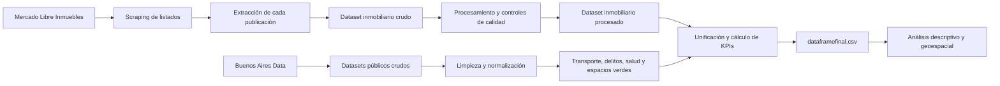

# TP – Análisis Descriptivo Inmobiliario de CABA

Análisis descriptivo del mercado inmobiliario de la Ciudad Autónoma de Buenos Aires orientado a un modelo de inversión **Buy to Rent**.

El proyecto construye un dataset propio de publicaciones inmobiliarias de Mercado Libre, lo complementa con información geográfica de transporte público, delitos, salud y espacios verdes de CABA, y unifica todo en un único dataset analítico con KPIs de inversión a nivel publicación.

## Objetivo del proyecto

El objetivo es analizar propiedades residenciales de CABA para identificar zonas y tipologías con potencial de inversión mediante la comparación de:

- Precios de venta y alquiler.
- Precio por metro cuadrado.
- Superficie, ambientes y antigüedad.
- Expensas y amenities.
- Tipo de propiedad.
- Ubicación geográfica.
- Cercanía al transporte público.
- Presencia de espacios verdes.
- Concentración de hechos delictivos.

El análisis está orientado a un inversor que busca comprar una propiedad, alquilarla de manera tradicional y conservarla durante varios años.

## Alcance

- **Ubicación:** Ciudad Autónoma de Buenos Aires.
- **Operaciones:** venta y alquiler.
- **Propiedades principales:** departamentos, PH y casas.
- **Propiedades conservadas pero fuera del análisis residencial:** oficinas y locales.
- **Período inmobiliario:** publicaciones activas durante el scraping realizado entre el 14 y el 17 de agosto de 2026.
- **Delitos:** años 2023, 2024 y 2025.
- **Unidad de análisis inmobiliaria:** una publicación de Mercado Libre.

## Flujo general de datos



## Estructura del repositorio

```text
.
├── README.md
├── scrapper/
│   ├── mercadolibre_scraping_completo.py
│   └── MercadoLibre_scraper.py
├── data/
│   ├── raw/
│   │   ├── delitos_2023.csv
│   │   ├── delitos_2024.csv
│   │   ├── delitos_2025.csv
│   │   ├── espacio_verde_publico.csv
│   │   ├── estaciones-de-metrobus.csv
│   │   ├── estaciones_de_subte.csv
│   │   ├── estaciones_ferroviarias.csv
│   │   ├── paradas-de-colectivo.csv
│   │   └── enlace_output_scrappeo_MeLi
│   ├── processing codes/
│   │   ├── limpiar_colectivos.py
│   │   ├── limpiar_espacios_verdes.py
│   │   ├── limpiar_metrobus.py
│   │   ├── limpiar_subte.py
│   │   ├── limpiar_trenes.py
│   │   ├── procesar_datos_Mercadolibre.py
│   │   └── unificar_delitos.py
│   └── processed/
│       ├── colectivos_limpio.csv
│       ├── espacios_verdes_familiares_limpio.csv
│       ├── metrobus_limpio.csv
│       ├── subte_limpio.csv
│       ├── tren_limpio.csv
│       ├── Unificacion.ipynb
│       ├── dataframefinal.csv
│       └── enlace_scrappeo_procesado_MeLi
├── EDA/
│   └── EDA.ipynb
└── extras/
    ├── propuesta_negocio_descriptiva.pdf
    └── resumen_calidad_mercadolibre_caba.pdf
```

- `data/raw/`: archivos originales sin modificar.
- `data/processing codes/`: scripts utilizados para limpiar y transformar los datos.
- `data/processed/`: archivos preparados para el análisis.
- `scrapper/`: código utilizado para obtener las publicaciones inmobiliarias.
- `EDA/`: notebook de análisis exploratorio sobre el dataset unificado.
- `extras/`: documentación complementaria y reportes de calidad.

## Fuentes de datos

### Mercado Libre Inmuebles

El dataset inmobiliario fue construido mediante un scraper propio sobre las publicaciones públicas de [Mercado Libre Inmuebles](https://inmuebles.mercadolibre.com.ar/).

La búsqueda se dividió por:

- Operación: venta y alquiler.
- Tipo: departamento, PH, casa, oficina y local.
- Barrio de CABA.
- Página de resultados.

Esta división permitió recorrer una mayor cantidad de publicaciones que utilizando una única búsqueda general.

### Buenos Aires Data

Los datasets geográficos complementarios fueron descargados del portal oficial [Buenos Aires Data](https://data.buenosaires.gob.ar/):

- [Estaciones de subte](https://data.buenosaires.gob.ar/dataset/subte-estaciones)
- [Estaciones ferroviarias](https://data.buenosaires.gob.ar/dataset/estaciones-ferrocarril)
- [Estaciones de Metrobus](https://data.buenosaires.gob.ar/dataset/metrobus)
- [Paradas de colectivo](https://data.buenosaires.gob.ar/dataset/colectivos-paradas)
- [Delitos](https://data.buenosaires.gob.ar/dataset/delitos)
- [Espacios verdes](https://data.buenosaires.gob.ar/dataset/espacios-verdes)
- Hospitales y efectores de salud

Los archivos guardados en el repositorio son una copia de los datos utilizados en el trabajo. Las fuentes oficiales pueden actualizarse posteriormente.

## Extracción de Mercado Libre

El scraping se realizó en dos etapas.

### 1. Descubrimiento de publicaciones

Se recorrieron las páginas de resultados y se guardaron los enlaces, identificadores y datos básicos de cada publicación.

### 2. Extracción del detalle

Se ingresó individualmente a cada publicación para obtener la mayor cantidad posible de atributos estructurados y textuales.

Entre las variables obtenidas se encuentran:

- Identificador y enlace.
- Operación.
- Tipo de propiedad.
- Precio y moneda.
- Expensas.
- Dirección y barrio publicado.
- Latitud y longitud.
- Ambientes, dormitorios y baños.
- Superficie total y cubierta.
- Antigüedad.
- Estado del inmueble.
- Vendedor.
- Amenities y características.
- Título y descripción.
- Fecha y hora del scraping.

### Controles del scraper

El scraper implementa:

- Deduplicación por `Item_ID`.
- Control adicional de duplicados por enlace.
- Guardado incremental cada 50 publicaciones.
- Checkpoint para continuar una ejecución interrumpida.
- Registro de errores y URLs fallidas.
- Pausas entre solicitudes.
- Detección de captcha o bloqueo.
- Detención segura ante demasiados errores consecutivos.
- Escritura atómica para reducir el riesgo de archivos corruptos.

No se intentan evadir captchas ni mecanismos de protección del sitio.

### Resultado de la extracción

El dataset crudo contiene:

- **65.846 publicaciones**
- **56.553 publicaciones de venta**
- **9.293 publicaciones de alquiler**
- **186 columnas**
- **0 identificadores duplicados**
- **0 enlaces duplicados**

Por tipo de propiedad:

- Departamento: 45.222
- PH: 6.060
- Casa: 4.300
- Oficina: 4.329
- Local: 5.935

Para el análisis Buy to Rent residencial se consideran principalmente los **55.582 departamentos, PH y casas**. Las oficinas y los locales se conservan, pero quedan fuera del alcance principal.

Debido a su tamaño, los archivos inmobiliarios se distribuyen mediante Google Drive:

- [Dataset crudo de Mercado Libre](https://drive.google.com/file/d/1l2Xgb9xCmSfVGG7uE_JkXDR-RuG6U4LW/view?usp=drive_link)
- [Dataset procesado de Mercado Libre](https://drive.google.com/file/d/19rStMXtGiBTy-BMTic86LX5C47lYTlnX/view?usp=drive_link)

## Limpieza del dataset inmobiliario

El archivo crudo fue procesado con [`procesar_datos_Mercadolibre.py`](data/processing%20codes/procesar_datos_Mercadolibre.py).

El procesamiento:

- Conserva las 65.846 publicaciones.
- Selecciona 56 variables relevantes.
- Genera un dataset final de 67 columnas.
- No convierte precios entre monedas en esta etapa (la conversión se realiza en la unificación).
- No elimina publicaciones por ser outliers.
- No modifica precios, superficies o coordenadas originales.
- Conserva los textos originales necesarios para auditoría.
- Completa con `0` los valores faltantes de 18 variables binarias de amenities.
- Agrega controles de calidad y motivos de anomalía.

En las variables binarias de amenities:

- `1` significa que la característica fue detectada.
- `0` significa que no fue informada o no fue detectada.

Por lo tanto, un `0` no garantiza que el inmueble no tenga esa característica.

### Flags de calidad

Se incorporaron los siguientes controles:

- `Flag_Precio_Anomalo`
- `Flag_Operacion_Anomala`
- `Flag_Tipo_Propiedad_Anomalo`
- `Flag_Superficie_Anomala`
- `Flag_Ambientes_Anomalo`
- `Flag_Coordenadas_Anomalas`
- `Flag_Expensas_Anomalas`
- `Flag_Amenities_Anomalos`
- `Flag_Faltantes_Criticos`
- `Flag_Anomalia_General`
- `Motivo_Anomalia`

Estos flags permiten identificar registros que requieren revisión sin eliminarlos automáticamente.

## Limpieza de transporte público

Los datasets de transporte se normalizaron para obtener nombres de columnas compatibles, coordenadas separadas y variables de control.

### Subte

Archivo original: 90 estaciones.

Mejoras realizadas:

- Conversión de geometría WKT a `Latitud` y `Longitud`.
- Normalización del nombre de estación y línea.
- Control de coordenadas fuera de rango.
- Control de duplicados.
- Conservación de las 90 estaciones.

### Ferrocarril

Archivo original: 301 estaciones.

Mejoras realizadas:

- Conversión de geometría WKT a coordenadas.
- Normalización de nombres de líneas y ramales.
- Conservación de barrio, comuna y localidad.
- Creación de `Flag_Fuera_CABA`.
- Control de coordenadas y duplicados.

El archivo incluye estaciones del AMBA. No se eliminaron las estaciones externas: 231 quedaron marcadas como fuera del rectángulo de control de CABA y 70 quedaron dentro.

### Metrobus

Archivo original: 390 estaciones.

Mejoras realizadas:

- Normalización de latitud y longitud.
- Unión de las columnas `L1` a `L6`.
- Conservación del sentido de cada línea.
- Reconstrucción de direcciones faltantes.
- Creación de identificadores técnicos.
- Control de coordenadas y duplicados.

Se conservaron las 390 filas.

### Colectivos

Archivo original: 6.962 paradas.

Mejoras realizadas:

- Conversión de coordenadas con coma decimal.
- Unión y deduplicación de líneas.
- Conservación de los sentidos de circulación.
- Reconstrucción de direcciones faltantes.
- Normalización de comunas.
- Control de coordenadas anómalas.
- Marcado de posibles duplicados.

Las filas sospechosas fueron marcadas, pero no eliminadas. Se detectó una coordenada anómala y 206 registros potencialmente duplicados.

## Limpieza y unificación de delitos

Los archivos de 2023, 2024 y 2025 contienen en conjunto **447.938 registros**.

El script [`unificar_delitos.py`](data/processing%20codes/unificar_delitos.py):

- Unifica los tres años.
- Conserva el identificador original.
- Conserva año, mes, día, fecha y franja horaria.
- Conserva tipo y subtipo de delito.
- Conserva indicadores de uso de arma y moto.
- Conserva barrio, comuna y cantidad.
- Convierte latitud y longitud a valores numéricos.
- No elimina registros por coincidencia de fecha o ubicación si tienen identificadores diferentes.
- No inventa ni repara coordenadas.

Se descartan únicamente los registros con:

- Coordenadas faltantes.
- Coordenadas no numéricas o no finitas.
- Coordenadas iguales a cero.
- Coordenadas fuera de los límites geográficos utilizados para CABA.

Resultado esperado al ejecutar el script:

- **438.081 registros conservados**
- **9.857 registros descartados por coordenadas**
- **0 identificadores perdidos**
- **0 identificadores presentes en ambas salidas**

Los registros descartados se guardan en un CSV separado junto con el motivo de exclusión.

## Limpieza de espacios verdes

El dataset original contiene **2.176 espacios o polígonos verdes**.

Para el análisis se aplicó un criterio conservador orientado a lugares verdes grandes o de uso familiar.

Se incluyeron:

- Plazas sin evidencia de conflicto.
- Parques con superficie mínima de 1.000 m².
- Jardines identificados con al menos 5.000 m² o patio de juegos.
- Jardín Botánico.
- Reservas ecológicas.

Se excluyeron:

- Canteros centrales.
- Plazoletas pequeñas.
- Patios y paseos pequeños.
- Espacios asociados principalmente a canchas, clubes o plazas secas.
- Polígonos que no representan un espacio verde familiar independiente.

Resultado:

- **428 espacios verdes seleccionados**
- 359 plazas
- 58 parques
- 8 jardines o paseos verdes
- 2 reservas ecológicas
- 1 jardín botánico

El procesamiento geográfico:

- Repara geometrías inválidas cuando es posible.
- Proyecta temporalmente las geometrías a UTM 21S.
- Calcula el centroide geométrico.
- Conserva el centroide original.
- Utiliza un punto representativo interno cuando el centroide cae fuera del polígono.
- Devuelve las coordenadas finales en EPSG:4326.
- Marca los casos que requieren revisión manual.

Las columnas `Latitud_Centroide` y `Longitud_Centroide` contienen el centro geométrico. Las columnas principales `Latitud` y `Longitud` contienen un punto utilizable dentro del espacio verde.

## Unificación y construcción del dataset final

El notebook [`Unificacion.ipynb`](data/processed/Unificacion.ipynb) toma el dataset inmobiliario procesado, lo acota al universo residencial, calcula los KPIs de inversión y le agrega las variables de entorno derivadas de los datasets geográficos. Su salida es `dataframefinal.csv`, el archivo sobre el que se realiza el análisis descriptivo.

### 1. Acotamiento del universo

- Se conservan únicamente las publicaciones de **departamento, PH y casa**: **55.582 filas**.
- Oficinas y locales quedan fuera del dataset final.

### 2. Normalización de barrios

`Barrio_Publicado` mezcla barrios oficiales con denominaciones comerciales. Se creó `Barrio_Normalizado` mapeando los casos frecuentes a los 48 barrios oficiales de CABA:

| Publicado | Normalizado |
|---|---|
| Once | Balvanera |
| Barrio Norte | Recoleta |
| Las Cañitas | Palermo |
| Paternal | La Paternal |
| Santa Rita | Villa Santa Rita |
| Villa Gral. Mitre | Villa General Mitre |
| Velez Sarsfield | Vélez Sarsfield |

El notebook incluye una verificación que corta la ejecución si aparece algún barrio sin mapear. Quedaron **133 publicaciones sin barrio informado**, que se excluyen de los KPIs por zona pero se conservan en el dataset.

### 3. Conversión de moneda

Los precios se llevan a una unidad común mediante `Precio_USD` y `Expensas_USD`, usando un tipo de cambio fijo de **1.522 ARS/USD** (dólar blue, promedio del 14 al 17 de agosto de 2026, coincidente con la ventana de scraping).

Cuando `Moneda_Expensas` está vacía se asume ARS.

### 4. Limpieza de antigüedad y ambientes

- `Antiguedad_limpia`: conserva únicamente valores entre 0 y 150 años; el resto queda como nulo.
- `Ambientes_Agrupado`: agrupa en `1`, `2`, `3` y `4+` para tener volumen suficiente por categoría.

### 5. Filtro de calidad para KPIs monetarios

Los cálculos de precio exigen que la publicación:

- Tenga `Flag_Precio_Anomalo`, `Flag_Operacion_Anomala` y `Flag_Superficie_Anomala` en `0`.
- Tenga superficie total mayor a cero.
- Tenga un `Precio_m2_USD` dentro de los percentiles 1 y 99 **de su tipo de operación**.

Resultado: **53.628 de 54.720** publicaciones pasan el filtro.

Las publicaciones que no lo pasan no se eliminan: quedan en el dataset pero no participan de los agregados de precio.

### 6. KPIs calculados

**Tasa de confort (`Tasa_Confort_Amenities`)**

Proporción de amenities presentes sobre una lista de 15 características de confort (amoblado, ascensor, balcón, terraza, patio, pileta, parrilla, SUM, gimnasio, laundry, seguridad, aire acondicionado, calefacción, lavadero, dormitorio en suite). Media 0,25 y mediana 0,20.

**Precio por metro cuadrado**

Promedio y mediana de `Precio_m2_USD` agregados por barrio y operación, y en una segunda tabla desagregados también por tipo de propiedad.

**Rentabilidad y payback**

Se agrupa por **barrio × tipo de propiedad × ambientes agrupados**, exigiendo un mínimo de 5 avisos por combinación para confiar en la mediana. Quedan **139 combinaciones** que tienen simultáneamente avisos de venta y de alquiler suficientes.

Sobre esas combinaciones se calcula:

```text
Rentabilidad_Bruta_Estimada = (Alquiler_Mediano × 12) / Precio_Venta_Mediano

Rentabilidad_Neta_Estimada  = (Alquiler_Mediano × 12
                               − Expensas_Medianas × 12
                               − Precio_Venta_Mediano × 1%) / Precio_Venta_Mediano

Payback_Period_Anios        = 1 / Rentabilidad_Neta_Estimada
```

El 1% anual corresponde a un supuesto de mantenimiento. Las expensas se calculan solo sobre registros sin `Flag_Expensas_Anomalas`, ya que el campo está informado en aproximadamente el 43% del dataset.

**Índice de sobre/subvaluación**

Para cada publicación se estima un precio esperado a partir de la mediana de `Precio_m2_USD` de sus comparables, multiplicada por su superficie. Los comparables se buscan en cascada, bajando de granularidad hasta encontrar al menos 8 avisos:

1. Barrio × tipo × rango de antigüedad × rango de confort
2. Barrio × tipo × rango de antigüedad
3. Barrio × tipo
4. Barrio

```text
Indice_Subvaluacion = (Precio_USD − Precio_Predicho_USD) / Precio_Predicho_USD
```

Un valor negativo indica que la publicación está por debajo de sus comparables. Se calculó sobre **51.673 publicaciones** (47.127 de venta y 4.591 de alquiler); solo 45 quedaron sin grupo comparable.

**Score de oportunidad**

Ranking de publicaciones de venta que combina rentabilidad de la zona y subvaluación individual, ambas normalizadas entre 0 y 1, con pesos iguales:

```text
Score_Oportunidad = (0,5 × Rentabilidad_Neta_norm + 0,5 × Subvaluacion_norm)
                    × Factor_Confianza × 100
```

El `Factor_Confianza` vale `1,0` si la publicación no tiene ninguna anomalía, `0,6` si tiene una anomalía no crítica, y `0,0` si tiene faltantes críticos o coordenadas anómalas (en cuyo caso queda excluida del ranking).

### 7. Variables de entorno geográfico

Las distancias se calculan proyectando latitud y longitud a coordenadas cartesianas sobre una esfera de radio 6.371 km y consultando un árbol `cKDTree` de SciPy. A la escala de CABA la diferencia respecto de la distancia sobre la superficie es despreciable.

| Variable | Descripción | Fuente |
|---|---|---|
| `Distancia_Subte_m` | Metros a la estación de subte más cercana | `subte_limpio.csv` (90 estaciones) |
| `Distancia_Hospital_m` | Metros al hospital más cercano | `hospitales_limpio.csv` |
| `Cantidad_Delitos_1000m` | Delitos registrados entre 2023 y 2025 dentro de un radio de 1.000 m | `delitos_2023_2025_unificado_limpio.csv` (438.081 registros) |
| `Cantidad_Colectivos_500m` | Paradas de colectivo dentro de un radio de 500 m | `colectivos_limpio.csv`, excluyendo paradas con coordenada anómala |

`Cantidad_Delitos_1000m` es un **conteo acumulado de los tres años**, no una tasa anual ni una tasa por habitante. Sirve para comparar entornos entre sí, no como medida absoluta de inseguridad.

Las **63 publicaciones sin coordenadas** quedan con estas cuatro variables en nulo.

### 8. Salida

El resultado se exporta como `dataframefinal.csv`: 55.582 filas con las variables originales del dataset procesado más las columnas de normalización, KPIs y entorno descriptas arriba.

> **Reproducibilidad:** el notebook fue desarrollado en Google Colab y lee los insumos desde rutas de Google Drive. Para ejecutarlo desde una copia local del repositorio hay que reemplazar esas rutas por las de `data/processed/`.

## Documentación complementaria

En la carpeta `extras/` se incluyen los documentos requeridos para el trabajo:

- [Propuesta de negocio y contextualización](extras/propuesta_negocio_descriptiva.pdf)
- [Resumen de calidad del dataset inmobiliario](extras/resumen_calidad_mercadolibre_caba.pdf)

La propuesta de negocio desarrolla:

- Contexto del inversor Buy to Rent.
- Preguntas descriptivas, diagnósticas, predictivas y prescriptivas.
- Hipótesis iniciales.
- KPIs propuestos.
- Limitaciones detectadas.
- Plan de integración geoespacial.
- Hoja de ruta del proyecto.

## Ejecución de los scripts

Desde la raíz del repositorio:

### Instalación

```bash
python3 -m venv .venv
source .venv/bin/activate
pip install pandas numpy requests beautifulsoup4 urllib3 shapely pyproj scipy
```

### Transporte

```bash
python3 "data/processing codes/limpiar_subte.py" \
  --entrada data/raw/estaciones_de_subte.csv \
  --salida data/processed/subte_limpio.csv

python3 "data/processing codes/limpiar_trenes.py" \
  --entrada data/raw/estaciones_ferroviarias.csv \
  --salida data/processed/tren_limpio.csv

python3 "data/processing codes/limpiar_metrobus.py" \
  --entrada data/raw/estaciones-de-metrobus.csv \
  --salida data/processed/metrobus_limpio.csv

python3 "data/processing codes/limpiar_colectivos.py" \
  --entrada data/raw/paradas-de-colectivo.csv \
  --salida data/processed/colectivos_limpio.csv
```

### Delitos

```bash
python3 "data/processing codes/unificar_delitos.py" \
  --entrada-2023 data/raw/delitos_2023.csv \
  --entrada-2024 data/raw/delitos_2024.csv \
  --entrada-2025 data/raw/delitos_2025.csv \
  --salida data/processed/delitos_2023_2025_unificado_limpio.csv \
  --descartados data/processed/delitos_coordenadas_descartadas.csv
```

### Espacios verdes

```bash
python3 "data/processing codes/limpiar_espacios_verdes.py" \
  --entrada data/raw/espacio_verde_publico.csv \
  --salida data/processed/espacios_verdes_familiares_limpio.csv \
  --excluidos data/processed/espacios_verdes_excluidos_revision.csv
```

### Mercado Libre

Después de descargar el CSV crudo desde Google Drive:

```bash
python3 "data/processing codes/procesar_datos_Mercadolibre.py" \
  --entrada data/raw/mercadolibre_caba_scraping_completo.csv \
  --salida data/processed/mercadolibre_caba_procesado.csv \
  --reporte extras/reporte_anomalias.csv
```

### Unificación

Una vez generados todos los archivos anteriores, se ejecuta `data/processed/Unificacion.ipynb`, que produce `dataframefinal.csv`.

> **Nota técnica:** `mercadolibre_scraping_completo.py` funciona como orquestador y utiliza el módulo `MercadoLibre_scraper.py`, que contiene los parsers de extracción. Para reproducir el scraping desde cero, ambos archivos deben encontrarse dentro de `scrapper/`.

## Limitaciones

### Del dataset inmobiliario

- Las publicaciones representan una fotografía del mercado durante los días del scraping.
- Los precios y la disponibilidad pueden cambiar o desaparecer.
- Mercado Libre puede mostrar ubicaciones aproximadas por privacidad.
- La ausencia de un amenity en una publicación no implica necesariamente que el inmueble no lo tenga. En consecuencia, la `Tasa_Confort_Amenities` mide qué tan completa es la publicación tanto como qué tan equipado está el inmueble.
- La clasificación entre alquiler tradicional y temporario tiene cobertura limitada.

### De los KPIs de inversión

- La conversión a dólares usa un tipo de cambio único y fijo. Los avisos de venta suelen publicarse en USD y los de alquiler en pesos, por lo que la elección del tipo de cambio impacta directamente sobre la rentabilidad estimada.
- La rentabilidad se calcula comparando **medianas de zona**, no propiedades individuales: no existe una misma unidad publicada simultáneamente en venta y en alquiler.
- El volumen de avisos de alquiler es mucho menor que el de venta (4.591 contra 47.127 en el modelo de valuación). Solo 139 combinaciones de barrio, tipo y ambientes tienen datos suficientes de ambas operaciones, lo que acota fuertemente la cobertura del ranking.
- La rentabilidad neta no descuenta impuestos, vacancia, comisiones ni gastos de escrituración.
- El `Payback_Period_Anios` pierde sentido cuando la rentabilidad neta es negativa o cercana a cero.
- El índice de subvaluación compara cada aviso contra la mediana de su propio grupo, que lo incluye, y asume que el precio crece de forma proporcional a la superficie.
- Los pesos del `Score_Oportunidad` son un supuesto del trabajo, no un resultado empírico. La normalización min-max es sensible a los valores extremos del índice de subvaluación.
- Un aviso "subvaluado" puede simplemente tener características no capturadas en los datos (estado, orientación, piso, calidad de la construcción).

### Del cruce geoespacial

- Los límites rectangulares utilizados para validar CABA son controles de plausibilidad, no reemplazan un cruce con el polígono oficial.
- El dataset ferroviario contiene estaciones fuera de CABA, identificadas mediante un flag.
- Los posibles duplicados de transporte se marcan, pero no se eliminan automáticamente.
- Las distancias son en línea recta, no de recorrido a pie.
- El conteo de delitos no está normalizado por población ni por flujo de personas, por lo que las zonas céntricas y de alta circulación aparecen con valores altos aunque no sean necesariamente más riesgosas para un residente.

## Próximas etapas

- Análisis exploratorio del dataset unificado (`EDA/EDA.ipynb`).
- Incorporar distancia a espacios verdes, tren y Metrobus, que ya están limpios pero todavía no se cruzaron.
- Revisar conflictos de amenities y cobertura de expensas.
- Mejorar la clasificación de alquiler tradicional y temporario.
- Construir un índice de conectividad que resuma las variables de transporte.
- Generar visualizaciones y mapas para el análisis descriptivo.
- Validar el ranking de oportunidades contra casos concretos.

## Uso académico y licencias

Este repositorio fue desarrollado con fines académicos.

Los datasets públicos pertenecen al Gobierno de la Ciudad Autónoma de Buenos Aires y mantienen las licencias informadas en sus respectivas fichas de Buenos Aires Data.

Las publicaciones inmobiliarias pertenecen a Mercado Libre y a sus respectivos anunciantes. Su utilización en este proyecto corresponde a una muestra académica y no implica afiliación con la plataforma.

Antes de reutilizar o redistribuir los datos, se recomienda revisar las condiciones y licencias vigentes de cada fuente.

## Detalle de los scripts de limpieza

En esta sección se resume, a grandes rasgos, qué procesamiento realiza cada uno de los archivos ubicados en la carpeta `data/processing codes/`.

### `procesar_datos_Mercadolibre.py`

Procesa el archivo completo obtenido mediante el scraping de Mercado Libre.

El script:

- Conserva todas las publicaciones obtenidas.
- Reduce las 186 columnas originales a 56 variables relevantes para el análisis.
- Agrega 9 flags temáticos de control de calidad.
- Agrega un flag general y una descripción del motivo de la anomalía.
- Mantiene separados el precio y la moneda.
- Conserva las coordenadas geográficas de las propiedades.
- No convierte monedas.
- No elimina automáticamente outliers.
- Completa con `0` los amenities no informados para que puedan utilizarse como variables binarias.

El resultado es un dataset de 67 columnas preparado para el análisis descriptivo.

### `limpiar_subte.py`

Procesa el archivo de estaciones de subte.

El archivo original almacenaba las coordenadas dentro de una geometría con formato:

```text
POINT (longitud latitud)
```

El script:

- Separa la geometría en las columnas `Latitud` y `Longitud`.
- Normaliza los nombres de las estaciones.
- Normaliza las líneas de subte.
- Agrega la variable `Tipo_Transporte`.
- Controla que las coordenadas se encuentren dentro de valores razonables.
- Marca posibles coordenadas anómalas.
- Marca posibles registros duplicados.
- Conserva las 90 estaciones originales.

Estas coordenadas permiten calcular la distancia entre cada propiedad y la estación de subte más cercana (`Distancia_Subte_m`).

### `limpiar_trenes.py`

Procesa el archivo de estaciones ferroviarias.

El script:

- Separa la geometría WKT en `Latitud` y `Longitud`.
- Normaliza los nombres de las líneas ferroviarias.
- Conserva el nombre de la estación y el ramal.
- Conserva barrio, comuna y localidad cuando están informados.
- Agrega la variable `Tipo_Transporte`.
- Marca coordenadas anómalas.
- Crea un flag para identificar estaciones ubicadas fuera de CABA.
- Controla posibles duplicados.

El archivo contiene estaciones de CABA y del resto del AMBA. Por ese motivo, las estaciones externas no fueron eliminadas, sino identificadas mediante `Flag_Fuera_CABA`.

### `limpiar_metrobus.py`

Procesa el archivo de estaciones de Metrobus.

El script:

- Normaliza las coordenadas geográficas.
- Utiliza `X` como longitud y `Y` como latitud.
- Utiliza `coord_X` y `coord_Y` como respaldo y validación.
- Combina las columnas `L1` a `L6` en una única columna llamada `Lineas`.
- Conserva el sentido de circulación de cada línea.
- Reconstruye direcciones faltantes cuando existe información suficiente.
- Crea identificadores técnicos para las estaciones.
- Marca coordenadas anómalas.
- Controla posibles duplicados.
- Conserva las 390 estaciones originales.

El resultado permite calcular la cercanía de cada inmueble a la red de Metrobus.

### `limpiar_colectivos.py`

Procesa el archivo de paradas de colectivo.

El script:

- Convierte las coordenadas con coma decimal a valores numéricos.
- Separa las coordenadas en `Latitud` y `Longitud`.
- Combina las líneas disponibles en cada parada.
- Elimina líneas repetidas dentro de un mismo registro.
- Conserva el sentido de circulación.
- Calcula la cantidad de líneas por parada.
- Reconstruye direcciones faltantes a partir de la calle y la altura.
- Normaliza barrios y comunas.
- Marca coordenadas anómalas.
- Identifica posibles duplicados.

Se conservaron las 6.962 filas originales. Los registros sospechosos fueron marcados mediante flags, pero no se eliminaron automáticamente.

Este dataset se utiliza para calcular `Cantidad_Colectivos_500m`, excluyendo las paradas marcadas con coordenada anómala.

### `unificar_delitos.py`

Procesa y unifica los archivos de delitos correspondientes a 2023, 2024 y 2025.

El script:

- Une los tres archivos en un único dataset.
- Conserva el identificador original de cada hecho.
- Conserva el año, mes, día, fecha y franja horaria.
- Conserva el tipo y subtipo de delito.
- Conserva los indicadores de uso de arma y moto.
- Conserva barrio, comuna y cantidad.
- Convierte `Latitud` y `Longitud` a valores numéricos.
- Verifica que los identificadores sean únicos.
- Guarda los registros rechazados en un archivo separado.

Se eliminaron únicamente los registros con:

- Coordenadas faltantes.
- Coordenadas iguales a cero.
- Coordenadas no numéricas.
- Coordenadas no finitas.
- Coordenadas fuera de los límites utilizados para CABA.

Los archivos originales contenían 447.938 registros. Luego del procesamiento se conservaron 438.081 y se separaron 9.857 por problemas en sus coordenadas.

Este dataset se utiliza para calcular `Cantidad_Delitos_1000m`.

### `limpiar_espacios_verdes.py`

Procesa el archivo de espacios verdes públicos.

El archivo original contenía plazas, parques, plazoletas, canteros centrales, patios recreativos y otros tipos de espacios urbanos.

Para el análisis se conservaron principalmente los espacios verdes grandes o destinados al uso familiar.

Se incluyeron:

- Plazas sin conflictos evidentes.
- Parques con una superficie mínima de 1.000 m².
- Jardines identificados con al menos 5.000 m² o con patio de juegos.
- El Jardín Botánico.
- Reservas ecológicas.

Se excluyeron:

- Canteros centrales.
- Plazoletas pequeñas.
- Patios y paseos de superficie reducida.
- Canchas, clubes y plazas secas.
- Espacios que no representaban claramente un área verde familiar independiente.

El script también realizó un procesamiento geográfico:

- Validó las geometrías.
- Reparó geometrías inválidas cuando fue posible.
- Proyectó temporalmente los polígonos a UTM 21S.
- Calculó el centroide de cada espacio verde.
- Verificó si el centroide se encontraba dentro del polígono.
- Utilizó un punto interno cuando el centroide quedaba fuera.
- Convirtió las coordenadas finales a EPSG:4326.
- Agregó flags de revisión y calidad geométrica.

Las columnas `Latitud_Centroide` y `Longitud_Centroide` conservan el centro geométrico calculado.

Las columnas principales `Latitud` y `Longitud` contienen un punto válido ubicado dentro del espacio verde, que puede utilizarse para representarlo en un mapa.

El resultado final contiene 428 espacios verdes:

- 359 plazas.
- 58 parques.
- 8 jardines o paseos verdes.
- 2 reservas ecológicas.
- 1 jardín botánico.

## Utilidad de las coordenadas geográficas

La incorporación y normalización de las coordenadas geográficas permite relacionar cada publicación inmobiliaria con las características de su entorno.

A partir de las columnas `Latitud` y `Longitud` ya se calcularon:

- Distancia a la estación de subte más cercana.
- Distancia al hospital más cercano.
- Cantidad de paradas de colectivo dentro de un radio de 500 metros.
- Cantidad de delitos dentro de un radio de 1.000 metros.

Y quedan pendientes de incorporar:

- Distancia a una estación ferroviaria.
- Distancia a una estación de Metrobus.
- Distancia al espacio verde familiar más cercano.
- Cantidad de líneas de colectivo cercanas.
- Un índice general de conectividad que resuma las variables anteriores.

El análisis se realiza utilizando la ubicación individual de cada propiedad, en lugar de asignar el mismo valor promedio a todos los inmuebles de un barrio.

De esta manera, dos propiedades ubicadas dentro del mismo barrio pueden diferenciarse según su cercanía real al transporte público, los espacios verdes y otros elementos del entorno urbano.
