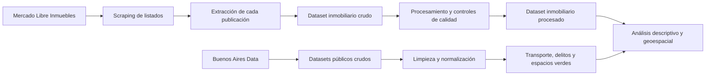

# TP – Análisis Descriptivo Inmobiliario de CABA

Análisis descriptivo del mercado inmobiliario de la Ciudad Autónoma de Buenos Aires orientado a un modelo de inversión **Buy to Rent**.

El proyecto construye un dataset propio de publicaciones inmobiliarias de Mercado Libre y lo complementa con información geográfica de transporte público, delitos y espacios verdes de CABA.

## Objetivo del proyecto

El objetivo es analizar propiedades residenciales de CABA para identificar zonas y tipologías con potencial de inversión mediante la comparación de:

- Precios de venta y alquiler.
- Precio por metro cuadrado.
- Superficie, ambientes y antigüedad.
- Expensas y amenities.
- Tipo de propiedad.
- Ubicación geográfica.
- Cercanía al transporte público.
- Presencia de espacios verdes.
- Concentración de hechos delictivos.

El análisis está orientado a un inversor que busca comprar una propiedad, alquilarla de manera tradicional y conservarla durante varios años.

## Alcance

- **Ubicación:** Ciudad Autónoma de Buenos Aires.
- **Operaciones:** venta y alquiler.
- **Propiedades principales:** departamentos, PH y casas.
- **Propiedades conservadas pero fuera del análisis residencial:** oficinas y locales.
- **Período inmobiliario:** publicaciones activas durante el scraping realizado entre el 14 y el 17 de agosto de 2026.
- **Delitos:** años 2023, 2024 y 2025.
- **Unidad de análisis inmobiliaria:** una publicación de Mercado Libre.

## Flujo general de datos



## Estructura del repositorio

```text
.
├── README.md
├── scrapper/
│   └── mercadolibre_scraping_completo.py
├── data/
│   ├── raw/
│   │   ├── delitos_2023.csv
│   │   ├── delitos_2024.csv
│   │   ├── delitos_2025.csv
│   │   ├── espacio_verde_publico.csv
│   │   ├── estaciones-de-metrobus.csv
│   │   ├── estaciones_de_subte.csv
│   │   ├── estaciones_ferroviarias.csv
│   │   ├── paradas-de-colectivo.csv
│   │   └── enlace_output_scrappeo_MeLi
│   ├── processing codes/
│   │   ├── limpiar_colectivos.py
│   │   ├── limpiar_espacios_verdes.py
│   │   ├── limpiar_metrobus.py
│   │   ├── limpiar_subte.py
│   │   ├── limpiar_trenes.py
│   │   ├── procesar_datos_Mercadolibre.py
│   │   └── unificar_delitos.py
│   └── processed/
│       ├── colectivos_limpio.csv
│       ├── espacios_verdes_familiares_limpio.csv
│       ├── metrobus_limpio.csv
│       ├── subte_limpio.csv
│       ├── tren_limpio.csv
│       └── enlace_scrappeo_procesado_MeLi
└── extras/
    ├── propuesta_negocio_descriptiva.pdf
    └── resumen_calidad_mercadolibre_caba.pdf
```

- `data/raw/`: archivos originales sin modificar.
- `data/processing codes/`: scripts utilizados para limpiar y transformar los datos.
- `data/processed/`: archivos preparados para el análisis.
- `scrapper/`: código utilizado para obtener las publicaciones inmobiliarias.
- `extras/`: documentación complementaria y reportes de calidad.

## Fuentes de datos

### Mercado Libre Inmuebles

El dataset inmobiliario fue construido mediante un scraper propio sobre las publicaciones públicas de [Mercado Libre Inmuebles](https://inmuebles.mercadolibre.com.ar/).

La búsqueda se dividió por:

- Operación: venta y alquiler.
- Tipo: departamento, PH, casa, oficina y local.
- Barrio de CABA.
- Página de resultados.

Esta división permitió recorrer una mayor cantidad de publicaciones que utilizando una única búsqueda general.

### Buenos Aires Data

Los datasets geográficos complementarios fueron descargados del portal oficial [Buenos Aires Data](https://data.buenosaires.gob.ar/):

- [Estaciones de subte](https://data.buenosaires.gob.ar/dataset/subte-estaciones)
- [Estaciones ferroviarias](https://data.buenosaires.gob.ar/dataset/estaciones-ferrocarril)
- [Estaciones de Metrobus](https://data.buenosaires.gob.ar/dataset/metrobus)
- [Paradas de colectivo](https://data.buenosaires.gob.ar/dataset/colectivos-paradas)
- [Delitos](https://data.buenosaires.gob.ar/dataset/delitos)
- [Espacios verdes](https://data.buenosaires.gob.ar/dataset/espacios-verdes)

Los archivos guardados en el repositorio son una copia de los datos utilizados en el trabajo. Las fuentes oficiales pueden actualizarse posteriormente.

## Extracción de Mercado Libre

El scraping se realizó en dos etapas.

### 1. Descubrimiento de publicaciones

Se recorrieron las páginas de resultados y se guardaron los enlaces, identificadores y datos básicos de cada publicación.

### 2. Extracción del detalle

Se ingresó individualmente a cada publicación para obtener la mayor cantidad posible de atributos estructurados y textuales.

Entre las variables obtenidas se encuentran:

- Identificador y enlace.
- Operación.
- Tipo de propiedad.
- Precio y moneda.
- Expensas.
- Dirección y barrio publicado.
- Latitud y longitud.
- Ambientes, dormitorios y baños.
- Superficie total y cubierta.
- Antigüedad.
- Estado del inmueble.
- Vendedor.
- Amenities y características.
- Título y descripción.
- Fecha y hora del scraping.

### Controles del scraper

El scraper implementa:

- Deduplicación por `Item_ID`.
- Control adicional de duplicados por enlace.
- Guardado incremental cada 50 publicaciones.
- Checkpoint para continuar una ejecución interrumpida.
- Registro de errores y URLs fallidas.
- Pausas entre solicitudes.
- Detección de captcha o bloqueo.
- Detención segura ante demasiados errores consecutivos.
- Escritura atómica para reducir el riesgo de archivos corruptos.

No se intentan evadir captchas ni mecanismos de protección del sitio.

### Resultado de la extracción

El dataset crudo contiene:

- **65.846 publicaciones**
- **56.553 publicaciones de venta**
- **9.293 publicaciones de alquiler**
- **186 columnas**
- **0 identificadores duplicados**
- **0 enlaces duplicados**

Por tipo de propiedad:

- Departamento: 45.222
- PH: 6.060
- Casa: 4.300
- Oficina: 4.329
- Local: 5.935

Para el análisis Buy to Rent residencial se consideran principalmente los **55.582 departamentos, PH y casas**. Las oficinas y los locales se conservan, pero quedan fuera del alcance principal.

Debido a su tamaño, los archivos inmobiliarios se distribuyen mediante Google Drive:

- [Dataset crudo de Mercado Libre](https://drive.google.com/file/d/1l2Xgb9xCmSfVGG7uE_JkXDR-RuG6U4LW/view?usp=drive_link)
- [Dataset procesado de Mercado Libre](https://drive.google.com/file/d/19rStMXtGiBTy-BMTic86LX5C47lYTlnX/view?usp=drive_link)

## Limpieza del dataset inmobiliario

El archivo crudo fue procesado con [`procesar_datos_Mercadolibre.py`](data/processing%20codes/procesar_datos_Mercadolibre.py).

El procesamiento:

- Conserva las 65.846 publicaciones.
- Selecciona 56 variables relevantes.
- Genera un dataset final de 67 columnas.
- No convierte automáticamente precios entre monedas.
- No elimina publicaciones por ser outliers.
- No modifica precios, superficies o coordenadas originales.
- Conserva los textos originales necesarios para auditoría.
- Completa con `0` los valores faltantes de 18 variables binarias de amenities.
- Agrega controles de calidad y motivos de anomalía.

En las variables binarias de amenities:

- `1` significa que la característica fue detectada.
- `0` significa que no fue informada o no fue detectada.

Por lo tanto, un `0` no garantiza que el inmueble no tenga esa característica.

### Flags de calidad

Se incorporaron los siguientes controles:

- `Flag_Precio_Anomalo`
- `Flag_Operacion_Anomala`
- `Flag_Tipo_Propiedad_Anomalo`
- `Flag_Superficie_Anomala`
- `Flag_Ambientes_Anomalo`
- `Flag_Coordenadas_Anomalas`
- `Flag_Expensas_Anomalas`
- `Flag_Amenities_Anomalos`
- `Flag_Faltantes_Criticos`
- `Flag_Anomalia_General`
- `Motivo_Anomalia`

Estos flags permiten identificar registros que requieren revisión sin eliminarlos automáticamente.

## Limpieza de transporte público

Los datasets de transporte se normalizaron para obtener nombres de columnas compatibles, coordenadas separadas y variables de control.

### Subte

Archivo original: 90 estaciones.

Mejoras realizadas:

- Conversión de geometría WKT a `Latitud` y `Longitud`.
- Normalización del nombre de estación y línea.
- Control de coordenadas fuera de rango.
- Control de duplicados.
- Conservación de las 90 estaciones.

### Ferrocarril

Archivo original: 301 estaciones.

Mejoras realizadas:

- Conversión de geometría WKT a coordenadas.
- Normalización de nombres de líneas y ramales.
- Conservación de barrio, comuna y localidad.
- Creación de `Flag_Fuera_CABA`.
- Control de coordenadas y duplicados.

El archivo incluye estaciones del AMBA. No se eliminaron las estaciones externas: 231 quedaron marcadas como fuera del rectángulo de control de CABA y 70 quedaron dentro.

### Metrobus

Archivo original: 390 estaciones.

Mejoras realizadas:

- Normalización de latitud y longitud.
- Unión de las columnas `L1` a `L6`.
- Conservación del sentido de cada línea.
- Reconstrucción de direcciones faltantes.
- Creación de identificadores técnicos.
- Control de coordenadas y duplicados.

Se conservaron las 390 filas.

### Colectivos

Archivo original: 6.962 paradas.

Mejoras realizadas:

- Conversión de coordenadas con coma decimal.
- Unión y deduplicación de líneas.
- Conservación de los sentidos de circulación.
- Reconstrucción de direcciones faltantes.
- Normalización de comunas.
- Control de coordenadas anómalas.
- Marcado de posibles duplicados.

Las filas sospechosas fueron marcadas, pero no eliminadas. Se detectó una coordenada anómala y 206 registros potencialmente duplicados.

## Limpieza y unificación de delitos

Los archivos de 2023, 2024 y 2025 contienen en conjunto **447.938 registros**.

El script [`unificar_delitos.py`](data/processing%20codes/unificar_delitos.py):

- Unifica los tres años.
- Conserva el identificador original.
- Conserva año, mes, día, fecha y franja horaria.
- Conserva tipo y subtipo de delito.
- Conserva indicadores de uso de arma y moto.
- Conserva barrio, comuna y cantidad.
- Convierte latitud y longitud a valores numéricos.
- No elimina registros por coincidencia de fecha o ubicación si tienen identificadores diferentes.
- No inventa ni repara coordenadas.

Se descartan únicamente los registros con:

- Coordenadas faltantes.
- Coordenadas no numéricas o no finitas.
- Coordenadas iguales a cero.
- Coordenadas fuera de los límites geográficos utilizados para CABA.

Resultado esperado al ejecutar el script:

- **438.081 registros conservados**
- **9.857 registros descartados por coordenadas**
- **0 identificadores perdidos**
- **0 identificadores presentes en ambas salidas**

Los registros descartados se guardan en un CSV separado junto con el motivo de exclusión.

## Limpieza de espacios verdes

El dataset original contiene **2.176 espacios o polígonos verdes**.

Para el análisis se aplicó un criterio conservador orientado a lugares verdes grandes o de uso familiar.

Se incluyeron:

- Plazas sin evidencia de conflicto.
- Parques con superficie mínima de 1.000 m².
- Jardines identificados con al menos 5.000 m² o patio de juegos.
- Jardín Botánico.
- Reservas ecológicas.

Se excluyeron:

- Canteros centrales.
- Plazoletas pequeñas.
- Patios y paseos pequeños.
- Espacios asociados principalmente a canchas, clubes o plazas secas.
- Polígonos que no representan un espacio verde familiar independiente.

Resultado:

- **428 espacios verdes seleccionados**
- 359 plazas
- 58 parques
- 8 jardines o paseos verdes
- 2 reservas ecológicas
- 1 jardín botánico

El procesamiento geográfico:

- Repara geometrías inválidas cuando es posible.
- Proyecta temporalmente las geometrías a UTM 21S.
- Calcula el centroide geométrico.
- Conserva el centroide original.
- Utiliza un punto representativo interno cuando el centroide cae fuera del polígono.
- Devuelve las coordenadas finales en EPSG:4326.
- Marca los casos que requieren revisión manual.

Las columnas `Latitud_Centroide` y `Longitud_Centroide` contienen el centro geométrico. Las columnas principales `Latitud` y `Longitud` contienen un punto utilizable dentro del espacio verde.

## Documentación complementaria

En la carpeta `extras/` se incluyen los documentos requeridos para el trabajo:

- [Propuesta de negocio y contextualización](extras/propuesta_negocio_descriptiva.pdf)
- [Resumen de calidad del dataset inmobiliario](extras/resumen_calidad_mercadolibre_caba.pdf)

La propuesta de negocio desarrolla:

- Contexto del inversor Buy to Rent.
- Preguntas descriptivas, diagnósticas, predictivas y prescriptivas.
- Hipótesis iniciales.
- KPIs propuestos.
- Limitaciones detectadas.
- Plan de integración geoespacial.
- Hoja de ruta del proyecto.

## Ejecución de los scripts

Desde la raíz del repositorio:

### Instalación

```bash
python3 -m venv .venv
source .venv/bin/activate
pip install pandas numpy requests beautifulsoup4 urllib3 shapely pyproj
```

### Transporte

```bash
python3 "data/processing codes/limpiar_subte.py" \
  --entrada data/raw/estaciones_de_subte.csv \
  --salida data/processed/subte_limpio.csv

python3 "data/processing codes/limpiar_trenes.py" \
  --entrada data/raw/estaciones_ferroviarias.csv \
  --salida data/processed/tren_limpio.csv

python3 "data/processing codes/limpiar_metrobus.py" \
  --entrada data/raw/estaciones-de-metrobus.csv \
  --salida data/processed/metrobus_limpio.csv

python3 "data/processing codes/limpiar_colectivos.py" \
  --entrada data/raw/paradas-de-colectivo.csv \
  --salida data/processed/colectivos_limpio.csv
```

### Delitos

```bash
python3 "data/processing codes/unificar_delitos.py" \
  --entrada-2023 data/raw/delitos_2023.csv \
  --entrada-2024 data/raw/delitos_2024.csv \
  --entrada-2025 data/raw/delitos_2025.csv \
  --salida data/processed/delitos_2023_2025_unificado_limpio.csv \
  --descartados data/processed/delitos_coordenadas_descartadas.csv
```

### Espacios verdes

```bash
python3 "data/processing codes/limpiar_espacios_verdes.py" \
  --entrada data/raw/espacio_verde_publico.csv \
  --salida data/processed/espacios_verdes_familiares_limpio.csv \
  --excluidos data/processed/espacios_verdes_excluidos_revision.csv
```

### Mercado Libre

Después de descargar el CSV crudo desde Google Drive:

```bash
python3 "data/processing codes/procesar_datos_Mercadolibre.py" \
  --entrada data/raw/mercadolibre_caba_scraping_completo.csv \
  --salida data/processed/mercadolibre_caba_procesado.csv \
  --reporte extras/reporte_anomalias.csv
```

> **Nota técnica:** `mercadolibre_scraping_completo.py` funciona como orquestador y utiliza el módulo `MercadoLibre_scraper.py`, que contiene los parsers de extracción. Para reproducir el scraping desde cero, ambos archivos deben encontrarse dentro de `scrapper/`.

## Limitaciones

- Las publicaciones representan una fotografía del mercado durante los días del scraping.
- Los precios y la disponibilidad pueden cambiar o desaparecer.
- Mercado Libre puede mostrar ubicaciones aproximadas por privacidad.
- La ausencia de un amenity en una publicación no implica necesariamente que el inmueble no lo tenga.
- Los límites rectangulares utilizados para validar CABA son controles de plausibilidad, no reemplazan un cruce con el polígono oficial.
- El dataset ferroviario contiene estaciones fuera de CABA, identificadas mediante un flag.
- Los posibles duplicados de transporte se marcan, pero no se eliminan automáticamente.
- La clasificación entre alquiler tradicional y temporario tiene cobertura limitada.
- El análisis geoespacial definitivo y el cálculo de rentabilidad se realizarán en etapas posteriores.

## Próximas etapas

- Filtrar el universo inmobiliario a departamentos, PH y casas.
- Mejorar la clasificación de alquiler tradicional y temporario.
- Revisar expensas y conflictos de amenities.
- Realizar cruces espaciales con transporte, delitos y espacios verdes.
- Calcular precio de venta y alquiler por metro cuadrado.
- Estimar rentabilidad bruta y neta.
- Calcular distancia a transporte público y espacios verdes.
- Medir densidad de delitos en el entorno.
- Construir un índice de sobrevaluación o subvaluación.
- Generar un ranking de oportunidades de inversión.
- Construir visualizaciones y mapas para el análisis descriptivo.

## Uso académico y licencias

Este repositorio fue desarrollado con fines académicos.

Los datasets públicos pertenecen al Gobierno de la Ciudad Autónoma de Buenos Aires y mantienen las licencias informadas en sus respectivas fichas de Buenos Aires Data.

Las publicaciones inmobiliarias pertenecen a Mercado Libre y a sus respectivos anunciantes. Su utilización en este proyecto corresponde a una muestra académica y no implica afiliación con la plataforma.

Antes de reutilizar o redistribuir los datos, se recomienda revisar las condiciones y licencias vigentes de cada fuente.
