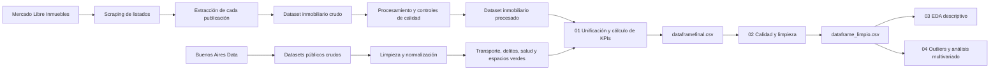

# TP – Análisis Descriptivo Inmobiliario de CABA

Análisis descriptivo del mercado inmobiliario de la Ciudad Autónoma de Buenos Aires orientado a un modelo de inversión **Buy to Rent**.

El proyecto construye un dataset propio de publicaciones inmobiliarias de Mercado Libre, lo complementa con información geográfica de transporte público, delitos, salud y espacios verdes de CABA, y unifica todo en un único dataset analítico con KPIs de inversión a nivel publicación.

## Objetivo del proyecto

El objetivo es analizar propiedades residenciales de CABA para identificar zonas y tipologías con potencial de inversión mediante la comparación de:

- Precios de venta y alquiler.
- Precio por metro cuadrado.
- Superficie, ambientes y antigüedad.
- Expensas y amenities.
- Tipo de propiedad.
- Ubicación geográfica.
- Cercanía al transporte público.
- Presencia de espacios verdes.
- Concentración de hechos delictivos.

El análisis está orientado a un inversor que busca comprar una propiedad, alquilarla de manera tradicional y conservarla durante varios años.

## Alcance

- **Ubicación:** Ciudad Autónoma de Buenos Aires.
- **Operaciones:** venta y alquiler.
- **Propiedades principales:** departamentos, PH y casas.
- **Propiedades conservadas pero fuera del análisis residencial:** oficinas y locales.
- **Período inmobiliario:** publicaciones activas durante el scraping realizado entre el 14 y el 17 de agosto de 2026.
- **Delitos:** años 2023, 2024 y 2025.
- **Unidad de análisis inmobiliaria:** una publicación de Mercado Libre.

## Cambios respecto de la primera entrega

La segunda entrega consolida lo desarrollado en el TP1 y agrega una etapa reproducible de calidad, EDA y análisis multivariado:

| Aspecto | Incorporación en el TP2 |
|---|---|
| Dataset analítico | Se parte de `dataframefinal.csv` (88 columnas) y se genera `dataframe_limpio.csv` (111 columnas). |
| Faltantes | Se documenta su cobertura y se aplican tratamientos explícitos únicamente cuando existe una regla acordada; cada imputación queda identificada. |
| Valores anómalos | Se distinguen datos inválidos, valores sospechosos y extremos plausibles. No se eliminan publicaciones automáticamente. |
| Duplicados | Se identifican grupos seguros y probables sin borrar filas del archivo original. |
| EDA | Se integran el análisis cualitativo, cuantitativo y las relaciones exploratorias entre variables. |
| Profundización | Se incorporan outliers contextuales, análisis de sensibilidad, modelos ajustados y escenarios Buy to Rent. |
| Reproducibilidad | Los cuatro notebooks quedan numerados y conectados mediante entradas y salidas explícitas. |

## Preguntas e hipótesis de trabajo

El análisis busca responder cuatro grupos de preguntas:

- **Descriptivas:** ¿cómo se distribuyen los precios, superficies, tipologías, ambientes y amenities en CABA?
- **Diagnósticas:** ¿qué características del inmueble y del entorno se relacionan con las diferencias de precio y rentabilidad?
- **Predictivas:** ¿qué variables permiten construir un precio de referencia para comparar publicaciones?
- **Prescriptivas:** ¿qué barrios y segmentos presentan condiciones más atractivas para una estrategia Buy to Rent bajo distintos supuestos?

Las hipótesis iniciales del proyecto son:

| Hipótesis | Formulación resumida |
|---|---|
| H1 | Los barrios del sur y oeste presentan mayor rentabilidad estimada que los barrios premium del norte. |
| H2 | Amenities y cochera incrementan proporcionalmente más el precio de venta que el alquiler y pueden reducir la rentabilidad relativa. |
| H3 | Las unidades de uno y dos ambientes presentan mayor rentabilidad estimada que las unidades de tres o más ambientes. |
| H4 | Una mayor distancia al subte se relaciona con un menor precio por m², incluso comparando dentro de un mismo barrio. |
| H4b | Una mayor accesibilidad a colectivos se relaciona con diferencias de precio dentro de una misma zona. |
| H5 | Una mayor concentración de delitos se relaciona con menores precios por m², controlando por características y barrio. |
| H6 | Las publicaciones de particulares tienen mayor probabilidad de aparecer subvaluadas que las de inmobiliarias. |
| H7 | El acceso a espacios verdes tiene una relación diferencial con el precio de las unidades familiares de tres o más ambientes. |
| H8 | La distancia al centro de salud más cercano se relaciona con diferencias en el precio de venta por m². |

Estas hipótesis se consideran puntos de partida. Los notebooks distinguen evidencia descriptiva, asociaciones ajustadas y resultados no concluyentes; no se interpretan como relaciones causales.

## Principales resultados del TP2

- El dataset limpio conserva las **55.582 publicaciones residenciales** y amplía la base de 88 a **111 variables**, sin modificar las columnas originales.
- El barrio, la superficie, el tipo de propiedad y el nivel de amenities concentran gran parte de las diferencias observadas en los precios publicados.
- Los valores extremos no se eliminan de manera automática: los errores o datos imposibles se apartan de los cálculos correspondientes y los extremos plausibles se conservan para evitar sesgar la oferta premium.
- En los modelos ajustados no aparece evidencia clara de una prima por cercanía al subte. La concentración de delitos presenta una asociación negativa con los precios, pero su magnitud es sensible a los extremos y no debe interpretarse causalmente.
- El efecto diferencial de los espacios verdes sobre las unidades familiares no resulta robusto entre especificaciones.
- Los escenarios Buy to Rent son exploratorios y dependen de la cobertura del alquiler tradicional, las expensas, la vacancia, el mantenimiento y el tipo de cambio. No constituyen una recomendación de inversión.

## Flujo general de datos


```mermaid
flowchart LR
    A[Mercado Libre Inmuebles] --> B[Scraping de listados]
    B --> C[Extracción de cada publicación]
    C --> D[Dataset inmobiliario crudo]
    D --> E[Procesamiento y controles de calidad]

    F[Buenos Aires Data] --> G[Datasets públicos crudos]
    G --> H[Limpieza y normalización]

    E --> I[Dataset inmobiliario procesado]
    H --> J[Transporte, delitos, salud y espacios verdes]
    I --> U[01 Unificación y cálculo de KPIs]
    J --> U
    U --> V[dataframefinal.csv]
    V --> Q[02 Calidad y limpieza]
    Q --> L[dataframe_limpio.csv]
    L --> K[03 EDA descriptivo]
    L --> M[04 Outliers y análisis multivariado]
```

## Estructura del repositorio

```text
.
├── README.md
├── .gitignore
├── scrapper/
│   ├── mercadolibre_scraping_completo.py
│   └── MercadoLibre_scraper.py
├── data/
│   ├── raw/
│   │   ├── delitos_2023.csv
│   │   ├── delitos_2024.csv
│   │   ├── delitos_2025.csv
│   │   ├── espacio_verde_publico.csv
│   │   ├── estaciones-de-metrobus.csv
│   │   ├── estaciones_de_subte.csv
│   │   ├── estaciones_ferroviarias.csv
│   │   ├── hospitales.csv
│   │   ├── paradas-de-colectivo.csv
│   │   └── enlace_output_scrappeo_MeLi
│   ├── processing codes/
│   │   ├── limpiar_colectivos.py
│   │   ├── limpiar_espacios_verdes.py
│   │   ├── limpiar_hospitales.py
│   │   ├── limpiar_metrobus.py
│   │   ├── limpiar_subte.py
│   │   ├── limpiar_trenes.py
│   │   ├── procesar_datos_Mercadolibre.py
│   │   └── unificar_delitos.py
│   └── processed/
│       ├── colectivos_limpio.csv
│       ├── delitos_2023_2025_unificado_limpio.csv
│       ├── espacios_verdes_familiares_limpio.csv
│       ├── hospitales_limpio.csv
│       ├── mercadolibre_caba_procesado.csv
│       ├── metrobus_limpio.csv
│       ├── subte_limpio.csv
│       ├── tren_limpio.csv
│       ├── dataframefinal.csv
│       ├── dataframe_limpio.csv
│       └── enlace_scrappeo_procesado_MeLi
├── notebooks/
│   ├── 01_unificacion.ipynb
│   ├── 02_calidad_y_limpieza.ipynb
│   ├── 03_eda_inicial.ipynb
│   └── 04_outliers_y_analisis_multivariado.ipynb
└── extras/
    ├── propuesta_negocio_descriptiva.pdf
    └── resumen_calidad_mercadolibre_caba.pdf
```

- `data/raw/`: archivos originales sin modificar.
- `data/processing codes/`: scripts utilizados para limpiar y transformar los datos.
- `data/processed/`: archivos preparados para el análisis.
- `scrapper/`: código utilizado para obtener las publicaciones inmobiliarias.
- `notebooks/`: análisis sobre el dataset unificado (EDA inicial, limpieza de faltantes y duplicados, y análisis multivariado).
- `extras/`: documentación complementaria y reportes de calidad.
- `data/processed/dataframefinal.csv`: salida de `notebooks/01_unificacion.ipynb` (88 columnas).
- `data/processed/dataframe_limpio.csv`: salida de `notebooks/02_calidad_y_limpieza.ipynb` (111 columnas). **Está versionado** y es la entrada de los notebooks 03 y 04.

## Fuentes de datos

### Mercado Libre Inmuebles

El dataset inmobiliario fue construido mediante un scraper propio sobre las publicaciones públicas de [Mercado Libre Inmuebles](https://inmuebles.mercadolibre.com.ar/).

La búsqueda se dividió por:

- Operación: venta y alquiler.
- Tipo: departamento, PH, casa, oficina y local.
- Barrio de CABA.
- Página de resultados.

Esta división permitió recorrer una mayor cantidad de publicaciones que utilizando una única búsqueda general.

### Buenos Aires Data

Los datasets geográficos complementarios fueron descargados del portal oficial [Buenos Aires Data](https://data.buenosaires.gob.ar/):

- [Estaciones de subte](https://data.buenosaires.gob.ar/dataset/subte-estaciones)
- [Estaciones ferroviarias](https://data.buenosaires.gob.ar/dataset/estaciones-ferrocarril)
- [Estaciones de Metrobus](https://data.buenosaires.gob.ar/dataset/metrobus)
- [Paradas de colectivo](https://data.buenosaires.gob.ar/dataset/colectivos-paradas)
- [Delitos](https://data.buenosaires.gob.ar/dataset/delitos)
- [Espacios verdes](https://data.buenosaires.gob.ar/dataset/espacios-verdes)
- [Hospitales](https://data.buenosaires.gob.ar/dataset/hospitales)

Los archivos guardados en el repositorio son una copia de los datos utilizados en el trabajo. Las fuentes oficiales pueden actualizarse posteriormente.

## Extracción de Mercado Libre

El scraping se realizó en dos etapas.

### 1. Descubrimiento de publicaciones

Se recorrieron las páginas de resultados y se guardaron los enlaces, identificadores y datos básicos de cada publicación.

### 2. Extracción del detalle

Se ingresó individualmente a cada publicación para obtener la mayor cantidad posible de atributos estructurados y textuales.

Entre las variables obtenidas se encuentran:

- Identificador y enlace.
- Operación.
- Tipo de propiedad.
- Precio y moneda.
- Expensas.
- Dirección y barrio publicado.
- Latitud y longitud.
- Ambientes, dormitorios y baños.
- Superficie total y cubierta.
- Antigüedad.
- Estado del inmueble.
- Vendedor.
- Amenities y características.
- Título y descripción.
- Fecha y hora del scraping.

### Controles del scraper

El scraper implementa:

- Deduplicación por `Item_ID`.
- Control adicional de duplicados por enlace.
- Guardado incremental cada 50 publicaciones.
- Checkpoint para continuar una ejecución interrumpida.
- Registro de errores y URLs fallidas.
- Pausas entre solicitudes.
- Detección de captcha o bloqueo.
- Detención segura ante demasiados errores consecutivos.
- Escritura atómica para reducir el riesgo de archivos corruptos.

No se intentan evadir captchas ni mecanismos de protección del sitio.

### Resultado de la extracción

El dataset crudo contiene:

- **65.846 publicaciones**
- **56.553 publicaciones de venta**
- **9.293 publicaciones de alquiler**
- **186 columnas**
- **0 identificadores duplicados**
- **0 enlaces duplicados**

Por tipo de propiedad:

- Departamento: 45.222
- PH: 6.060
- Casa: 4.300
- Oficina: 4.329
- Local: 5.935

Para el análisis Buy to Rent residencial se consideran principalmente los **55.582 departamentos, PH y casas**. Las oficinas y los locales se conservan, pero quedan fuera del alcance principal.

El **dataset procesado** (`data/processed/mercadolibre_caba_procesado.csv`, 33 MB) está incluido en el repositorio.

El **dataset crudo**, con las 186 columnas originales, se distribuye por Google Drive porque excede el límite práctico de GitHub:

- [Dataset crudo de Mercado Libre](https://drive.google.com/file/d/1l2Xgb9xCmSfVGG7uE_JkXDR-RuG6U4LW/view?usp=drive_link)

## Limpieza del dataset inmobiliario

El archivo crudo fue procesado con [`procesar_datos_Mercadolibre.py`](data/processing%20codes/procesar_datos_Mercadolibre.py).

El procesamiento:

- Conserva las 65.846 publicaciones.
- Selecciona 56 variables relevantes.
- Genera un dataset final de 67 columnas.
- No convierte precios entre monedas en esta etapa (la conversión se realiza en la unificación).
- No elimina publicaciones por ser outliers.
- No modifica precios, superficies o coordenadas originales.
- Conserva los textos originales necesarios para auditoría.
- Completa con `0` los valores faltantes de 18 variables binarias de amenities.
- Agrega controles de calidad y motivos de anomalía.

En las variables binarias de amenities:

- `1` significa que la característica fue detectada.
- `0` significa que no fue informada o no fue detectada.

Por lo tanto, un `0` no garantiza que el inmueble no tenga esa característica.

### Flags de calidad

Se incorporaron los siguientes controles:

- `Flag_Precio_Anomalo`
- `Flag_Operacion_Anomala`
- `Flag_Tipo_Propiedad_Anomalo`
- `Flag_Superficie_Anomala`
- `Flag_Ambientes_Anomalo`
- `Flag_Coordenadas_Anomalas`
- `Flag_Expensas_Anomalas`
- `Flag_Amenities_Anomalos`
- `Flag_Faltantes_Criticos`
- `Flag_Anomalia_General`
- `Motivo_Anomalia`

Estos flags permiten identificar registros que requieren revisión sin eliminarlos automáticamente.

## Limpieza de transporte público

Los datasets de transporte se normalizaron para obtener nombres de columnas compatibles, coordenadas separadas y variables de control.

### Subte

Archivo original: 90 estaciones.

Mejoras realizadas:

- Conversión de geometría WKT a `Latitud` y `Longitud`.
- Normalización del nombre de estación y línea.
- Control de coordenadas fuera de rango.
- Control de duplicados.
- Conservación de las 90 estaciones.

### Ferrocarril

Archivo original: 301 estaciones.

Mejoras realizadas:

- Conversión de geometría WKT a coordenadas.
- Normalización de nombres de líneas y ramales.
- Conservación de barrio, comuna y localidad.
- Creación de `Flag_Fuera_CABA`.
- Control de coordenadas y duplicados.

El archivo incluye estaciones del AMBA. No se eliminaron las estaciones externas: 231 quedaron marcadas como fuera del rectángulo de control de CABA y 70 quedaron dentro.

### Metrobus

Archivo original: 390 estaciones.

Mejoras realizadas:

- Normalización de latitud y longitud.
- Unión de las columnas `L1` a `L6`.
- Conservación del sentido de cada línea.
- Reconstrucción de direcciones faltantes.
- Creación de identificadores técnicos.
- Control de coordenadas y duplicados.

Se conservaron las 390 filas.

### Colectivos

Archivo original: 6.962 paradas.

Mejoras realizadas:

- Conversión de coordenadas con coma decimal.
- Unión y deduplicación de líneas.
- Conservación de los sentidos de circulación.
- Reconstrucción de direcciones faltantes.
- Normalización de comunas.
- Control de coordenadas anómalas.
- Marcado de posibles duplicados.

Las filas sospechosas fueron marcadas, pero no eliminadas. Se detectó una coordenada anómala y 206 registros potencialmente duplicados.

## Limpieza y unificación de delitos

Los archivos de 2023, 2024 y 2025 contienen en conjunto **447.938 registros**.

El script [`unificar_delitos.py`](data/processing%20codes/unificar_delitos.py):

- Unifica los tres años.
- Conserva el identificador original.
- Conserva año, mes, día, fecha y franja horaria.
- Conserva tipo y subtipo de delito.
- Conserva indicadores de uso de arma y moto.
- Conserva barrio, comuna y cantidad.
- Convierte latitud y longitud a valores numéricos.
- No elimina registros por coincidencia de fecha o ubicación si tienen identificadores diferentes.
- No inventa ni repara coordenadas.

Se descartan únicamente los registros con:

- Coordenadas faltantes.
- Coordenadas no numéricas o no finitas.
- Coordenadas iguales a cero.
- Coordenadas fuera de los límites geográficos utilizados para CABA.

Resultado esperado al ejecutar el script:

- **438.081 registros conservados**
- **9.857 registros descartados por coordenadas**
- **0 identificadores perdidos**
- **0 identificadores presentes en ambas salidas**

Los registros descartados se guardan en un CSV separado junto con el motivo de exclusión.

## Limpieza de espacios verdes

El dataset original contiene **2.176 espacios o polígonos verdes**.

Para el análisis se aplicó un criterio conservador orientado a lugares verdes grandes o de uso familiar.

Se incluyeron:

- Plazas sin evidencia de conflicto.
- Parques con superficie mínima de 1.000 m².
- Jardines identificados con al menos 5.000 m² o patio de juegos.
- Jardín Botánico.
- Reservas ecológicas.

Se excluyeron:

- Canteros centrales.
- Plazoletas pequeñas.
- Patios y paseos pequeños.
- Espacios asociados principalmente a canchas, clubes o plazas secas.
- Polígonos que no representan un espacio verde familiar independiente.

Resultado:

- **428 espacios verdes seleccionados**
- 359 plazas
- 58 parques
- 8 jardines o paseos verdes
- 2 reservas ecológicas
- 1 jardín botánico

El procesamiento geográfico:

- Repara geometrías inválidas cuando es posible.
- Proyecta temporalmente las geometrías a UTM 21S.
- Calcula el centroide geométrico.
- Conserva el centroide original.
- Utiliza un punto representativo interno cuando el centroide cae fuera del polígono.
- Devuelve las coordenadas finales en EPSG:4326.
- Marca los casos que requieren revisión manual.

Las columnas `Latitud_Centroide` y `Longitud_Centroide` contienen el centro geométrico. Las columnas principales `Latitud` y `Longitud` contienen un punto utilizable dentro del espacio verde.

## Unificación y construcción del dataset final

El notebook [`01_unificacion.ipynb`](notebooks/01_unificacion.ipynb) toma el dataset inmobiliario procesado, lo acota al universo residencial, calcula los KPI originales y agrega las variables de entorno derivadas de los datasets geográficos. Su salida es `dataframefinal.csv`, que luego pasa por el notebook de calidad y limpieza.

### 1. Acotamiento del universo

- Se conservan únicamente las publicaciones de **departamento, PH y casa**: **55.582 filas**.
- Oficinas y locales quedan fuera del dataset final.

### 2. Normalización de barrios

`Barrio_Publicado` mezcla barrios oficiales con denominaciones comerciales. Se creó `Barrio_Normalizado` mapeando los casos frecuentes a los 48 barrios oficiales de CABA:

| Publicado | Normalizado |
|---|---|
| Once | Balvanera |
| Barrio Norte | Recoleta |
| Las Cañitas | Palermo |
| Paternal | La Paternal |
| Santa Rita | Villa Santa Rita |
| Villa Gral. Mitre | Villa General Mitre |
| Velez Sarsfield | Vélez Sarsfield |

El notebook incluye una verificación que corta la ejecución si aparece algún barrio sin mapear. Quedaron **133 publicaciones sin barrio informado**, que se excluyen de los KPIs por zona pero se conservan en el dataset.

### 3. Conversión de moneda

Los precios se llevan a una unidad común mediante `Precio_USD` y `Expensas_USD`, usando un tipo de cambio fijo de **1.522 ARS/USD** (dólar blue, promedio del 14 al 17 de agosto de 2026, coincidente con la ventana de scraping).

Cuando `Moneda_Expensas` está vacía se asume ARS.

### 4. Limpieza de antigüedad y ambientes

- `Antiguedad_limpia`: conserva únicamente valores entre 0 y 150 años; el resto queda como nulo.
- `Ambientes_Agrupado`: agrupa en `1`, `2`, `3` y `4+` para tener volumen suficiente por categoría.

### 5. Filtro de calidad para KPIs monetarios

Los cálculos de precio exigen que la publicación:

- Tenga `Flag_Precio_Anomalo`, `Flag_Operacion_Anomala` y `Flag_Superficie_Anomala` en `0`.
- Tenga superficie total mayor a cero.
- Tenga un `Precio_m2_USD` dentro de los percentiles 1 y 99 **de su tipo de operación**.

Resultado: **53.628 de 54.720** publicaciones pasan el filtro.

Las publicaciones que no lo pasan no se eliminan: quedan en el dataset pero no participan de los agregados de precio.

### 6. KPIs calculados

**Tasa de confort (`Tasa_Confort_Amenities`)**

Proporción de amenities presentes sobre una lista de 15 características de confort (amoblado, ascensor, balcón, terraza, patio, pileta, parrilla, SUM, gimnasio, laundry, seguridad, aire acondicionado, calefacción, lavadero, dormitorio en suite). Media 0,25 y mediana 0,20.

**Precio por metro cuadrado**

Promedio y mediana de `Precio_m2_USD` agregados por barrio y operación, y en una segunda tabla desagregados también por tipo de propiedad.

**Rentabilidad y payback**

Se agrupa por **barrio × tipo de propiedad × ambientes agrupados**, exigiendo un mínimo de 5 avisos por combinación para confiar en la mediana. Quedan **139 combinaciones** que tienen simultáneamente avisos de venta y de alquiler suficientes.

Sobre esas combinaciones se calcula:

```text
Rentabilidad_Bruta_Estimada = (Alquiler_Mediano × 12) / Precio_Venta_Mediano

Rentabilidad_Neta_Estimada  = (Alquiler_Mediano × 12
                               − Expensas_Medianas × 12
                               − Precio_Venta_Mediano × 1%) / Precio_Venta_Mediano

Payback_Period_Anios        = 1 / Rentabilidad_Neta_Estimada
```

El 1% anual corresponde a un supuesto de mantenimiento. Las expensas se calculan solo sobre registros sin `Flag_Expensas_Anomalas`, ya que el campo está informado en aproximadamente el 43% del dataset.

**Índice de sobre/subvaluación**

Para cada publicación se estima un precio esperado a partir de la mediana de `Precio_m2_USD` de sus comparables, multiplicada por su superficie. Los comparables se buscan en cascada, bajando de granularidad hasta encontrar al menos 8 avisos:

1. Barrio × tipo × rango de antigüedad × rango de confort
2. Barrio × tipo × rango de antigüedad
3. Barrio × tipo
4. Barrio

```text
Indice_Subvaluacion = (Precio_USD − Precio_Predicho_USD) / Precio_Predicho_USD
```

Un valor negativo indica que la publicación está por debajo de sus comparables. Se calculó sobre **51.673 publicaciones** (47.127 de venta y 4.591 de alquiler); solo 45 quedaron sin grupo comparable.

**Score de oportunidad**

Ranking de publicaciones de venta que combina rentabilidad de la zona y subvaluación individual, ambas normalizadas entre 0 y 1, con pesos iguales:

```text
Score_Oportunidad = (0,5 × Rentabilidad_Neta_norm + 0,5 × Subvaluacion_norm)
                    × Factor_Confianza × 100
```

El `Factor_Confianza` vale `1,0` si la publicación no tiene ninguna anomalía, `0,6` si tiene una anomalía no crítica, y `0,0` si tiene faltantes críticos o coordenadas anómalas (en cuyo caso queda excluida del ranking).

### 7. Variables de entorno geográfico

Las distancias se calculan proyectando latitud y longitud a coordenadas cartesianas sobre una esfera de radio 6.371 km y consultando un árbol `cKDTree` de SciPy. A la escala de CABA la diferencia respecto de la distancia sobre la superficie es despreciable.

| Variable | Descripción | Fuente |
|---|---|---|
| `Distancia_Subte_m` | Metros a la estación de subte más cercana | `subte_limpio.csv` (90 estaciones) |
| `Distancia_Hospital_m` | Metros al hospital más cercano | `hospitales_limpio.csv` |
| `Cantidad_Delitos_1000m` | Delitos registrados entre 2023 y 2025 dentro de un radio de 1.000 m | `delitos_2023_2025_unificado_limpio.csv` (438.081 registros) |
| `Cantidad_Colectivos_500m` | Paradas de colectivo dentro de un radio de 500 m | `colectivos_limpio.csv`, excluyendo paradas con coordenada anómala |

`Cantidad_Delitos_1000m` es un **conteo acumulado de los tres años**, no una tasa anual ni una tasa por habitante. Sirve para comparar entornos entre sí, no como medida absoluta de inseguridad.

Las **63 publicaciones sin coordenadas** quedan con estas cuatro variables en nulo.

### 8. Salida

El resultado se exporta como `dataframefinal.csv`: 55.582 filas con las variables originales del dataset procesado más las columnas de normalización, KPIs y entorno descriptas arriba.

> **Reproducibilidad:** el notebook resuelve todas las rutas a partir de la raíz del repositorio, de modo que funciona desde cualquier copia local sin depender de Google Drive. Requiere `scipy`, y se ejecuta desde un entorno virtual con las dependencias del proyecto instaladas.

## Limpieza de faltantes, outliers y duplicados

El notebook [`02_calidad_y_limpieza.ipynb`](notebooks/02_calidad_y_limpieza.ipynb) toma `dataframefinal.csv`, diagnostica faltantes, precios fuera de contexto y avisos repetidos, y agrega columnas de marcas y tratamientos. No replica el EDA ni los modelos: su responsabilidad termina al generar `dataframe_limpio.csv`.

**Qué NO hace:** no borra ninguna fila y no modifica ningún valor de las 88 columnas originales. Antes de guardar, el notebook verifica con `assert` que las filas y los valores originales no cambiaron. Todo lo nuevo va en columnas aparte, así que cualquier tratamiento se puede ignorar.

**Entrada:** `data/processed/dataframefinal.csv`. **Salida:** `data/processed/dataframe_limpio.csv` (las mismas 55.582 filas, 88 columnas originales + 23 nuevas).

### Decisiones de grupo

| # | Tema | Decisión | Estado |
|---|---|---|---|
| 1 | Rentabilidad y H1 | H1 se evalúa solo en los barrios con rentabilidad en el nivel original; la cascada es prueba de robustez. | Aplicada |
| 2 | Precio por m² fuera de contexto | Se marcan con umbrales 0,40 y 2,50; no se borra. | Aplicada |
| 3 | Duplicados | Se marcan todos, con nivel `Seguro` o `Probable`; no se borra. | Aplicada |
| 4 | Cocheras en PH | Un nulo significa "no tiene": se imputa 0 y queda marcado. | Aplicada |
| 5 | Alquiler tradicional o temporario | Se informan resultados amplios y estrictos; la baja cobertura se declara como limitación. | Cerrada sin reclasificación automática |
| 7 | Expensas de PH y casas en la rentabilidad | Los ceros cuentan en la mediana de la celda. | Aplicada en `01_unificacion.ipynb` |
| 8 | Expensas de departamentos | Se imputan con la mediana de su celda y quedan marcadas. | Aplicada |
| | Balcón | Los nulos se conservan para no confundir ausencia de información con ausencia de balcón. | Cerrada sin imputación |

### Parámetros del notebook

| Parámetro | Valor | Significado |
|---|---|---|
| `IMPUTAR_COCHERAS_PH` | `True` | Imputa 0 en las cocheras nulas de PH (decisión 4). |
| `BALCON_0_ES_NO_TIENE` | `False` | Mantiene nula la superficie de balcón cuando no está informada; no se asume automáticamente que equivale a 0. |
| `EXPENSAS_CERO_DEPTO_ES_FALTANTE` | `True` | Los ceros de expensas de departamentos se tratan como faltantes. |
| `UNIFICACION_CUENTA_CEROS_PH_CASA` | `True` | Replica la versión actual de `01_unificacion.ipynb`, donde los ceros de expensas de PH y casas cuentan en la mediana. |
| `UMBRAL_BAJO`, `UMBRAL_ALTO` | `0,40`, `2,50` | Umbrales del precio por m² relativo a su grupo (decisión 2). |
| `K_VECINOS`, `MIN_N`, `MIN_N_GRUPO` | `15`, `5`, `8` | Vecinos para asignar barrio, mínimo de avisos por celda de rentabilidad y mínimo de avisos por grupo de precio. |

### Diccionario de las 23 columnas nuevas

Los conteos son sobre las 55.582 filas (ventas y alquileres), salvo que se indique otra cosa.

**Rentabilidad**

| Columna | Definición |
|---|---|
| `Motivo_Rentabilidad_Nula` | Por qué un aviso no tiene `Rentabilidad_Neta_Zona`. Valores: `Calculada` (42.067), `Faltan alquileres (<5)` (11.888), `Sin barrio o ambientes` (1.025), `Sin expensas válidas` (395) y `Faltan ventas y alquileres (<5 c/u)` (207). Replica la lógica de `01_unificacion.ipynb` y coincide en el 100% de los avisos. |
| `Flag_Rentabilidad_No_Calculable` | 1 si `Rentabilidad_Neta_Zona` es nula (13.515 filas). |
| `Rentabilidad_Neta_Cascada` | Rentabilidad neta con cascada de granularidad: Barrio × Tipo × Ambientes (igual a `Rentabilidad_Neta_Zona`, verificado con `assert`), después Barrio × Tipo y después Barrio. 327 nulos. **Columna experimental: no reemplaza** a la original. |
| `Nivel_Rentabilidad_Cascada` | Con qué nivel se calculó: `Barrio x Tipo x Ambientes` (42.067), `Barrio x Tipo` (8.493) o `Barrio` (4.695). Los valores de niveles gruesos no son comparables con los del nivel original. |

**Faltantes y codificaciones**

| Columna | Definición |
|---|---|
| `Estado_Inmueble_Limpio` | `Estado_Inmueble` con el texto "Desconocido" convertido en nulo (41.894 nulos). Informados: A estrenar 7.226, En pozo 3.554, Reciclado 1.591, A refaccionar 1.317. |
| `Tipo_Alquiler_Limpio` | `Tipo_Alquiler` con "Desconocido" convertido en nulo. También es nulo en las ventas (no aplica). Solo 454 alquileres están clasificados: Tradicional 239 y Temporario 215. |
| `Superficie_Balcon_m2_Tratada` | Igual a `Superficie_Balcon_m2` mientras `BALCON_0_ES_NO_TIENE = False`. Con `True`, pasa a 0 donde `Balcon = 0` y la superficie es nula. |
| `Flag_Balcon_Sin_Dato` | 1 donde `Balcon = 0` y la superficie de balcón es nula (21.522 filas). Se calcula siempre, se imputen o no. |
| `Cocheras_Tratada` | `Cocheras`, con las cocheras nulas de PH pasadas a 0 (decisión 4). 3 nulos. |
| `Flag_Cocheras_PH_Sin_Dato` | 1 en los PH con `Cocheras` nula, es decir, los imputados (5.201 filas). |
| `Expensas_USD_Limpio` | `Expensas_USD` con los ceros de **departamentos** pasados a nulo (en departamentos, un 0 casi siempre es "todavía no hay expensas fijadas"). En PH y casas los ceros se mantienen. 19.028 nulos. |
| `Expensas_USD_Imputada` | `Expensas_USD_Limpio`, y en los departamentos sin expensas, la mediana de su celda: Barrio × Ambientes (mínimo 5 avisos), si no el Barrio, si no la mediana global. En la validación cruzada, este método aproxima mejor que una regresión con amenities (error mediano de 32,7% contra 37,1%). 1.406 nulos, que son PH y casas con expensas nulas y no se imputan. |
| `Flag_Expensas_Imputada` | 1 en los departamentos con expensa imputada (17.622 filas: 16.215 ceros y 1.407 nulos). |
| `Flag_Antiguedad_Cero_Sin_Estado` | 1 si `Antiguedad = 0` y el estado no es "A estrenar" ni "En pozo" (11.132 filas). Marca los ceros que no se pueden verificar. **La antigüedad 0 no se trata como faltante.** |
| `Barrio_Completo` | `Barrio_Normalizado`, y para los 133 avisos sin barrio, el más frecuente entre los 15 avisos más cercanos por coordenadas. Acierta en el 87,4% de la validación. Es un dato **aproximado**: sirve para describir por barrio y no se usa para recalcular KPIs. |
| `Flag_Barrio_Por_Vecinos` | 1 en los avisos cuyo barrio se asignó por vecinos (133 filas). |

**Precios fuera de contexto**

| Columna | Definición |
|---|---|
| `Ratio_Precio_m2_vs_Mediana` | `Precio_m2_USD` dividido por la mediana de su grupo (Barrio × Tipo × Operación, mínimo 8 avisos; si no alcanza, Barrio × Operación). 1 significa igual a la mediana. 54.555 no nulos. |
| `Flag_Precio_m2_Muy_Bajo` | 1 si el ratio es menor a 0,40 (319 filas). Pueden ser oportunidades o errores de carga: se revisan a mano, no se borran. |
| `Flag_Precio_m2_Muy_Alto` | 1 si el ratio es mayor a 2,50 (210 filas). |

**Duplicados de contenido**

Se consideran el mismo inmueble los avisos con igual barrio, tipo, dirección, precio, superficie y ambientes (4.957 avisos en 2.218 grupos), aunque tengan `Item_ID` y `Link` distintos.

| Columna | Definición |
|---|---|
| `Grupo_Duplicado` | Identificador del grupo de avisos repetidos. Nulo si el aviso no tiene repetidos. Solo sirve para agrupar. |
| `Duplicado_Nivel` | Certeza del grupo. `Alto`: mismo piso informado, probable republicación (2.048 avisos). `Medio`: piso no informado, no se puede distinguir (2.372). `Bajo`: pisos distintos, probables unidades distintas (537). |
| `Duplicado_Sobrante_Nivel` | Para los avisos que no son la primera aparición de su grupo: `Seguro` (nivel Alto, 1.106) o `Probable` (nivel Medio, 1.295). Nulo en los demás, incluidos los de nivel Bajo. |
| `Flag_Duplicado_Sobrante` | 1 si `Duplicado_Sobrante_Nivel` no es nulo (2.401 filas). |

### Limitaciones

- Varios tratamientos descansan en supuestos que no se pueden probar con los datos (por ejemplo, que una cochera nula en PH significa "no tiene"). Por eso todos van en columnas aparte, con su marca.
- `Expensas_USD_Imputada` se validó en departamentos que sí informan expensas, que tienden a ser edificios más viejos. Aplicarla a edificios nuevos es una extrapolación: probablemente subestima.
- Los valores de `Rentabilidad_Neta_Cascada` en niveles distintos del original no son comparables entre sí.
- El impacto estadístico de los extremos y las decisiones de calidad se estudia en `04_outliers_y_analisis_multivariado.ipynb`; no se replica aquí el ranking de oportunidades.


## Documentación complementaria

En la carpeta `extras/` se incluyen los documentos requeridos para el trabajo:

- [Propuesta de negocio y contextualización](extras/propuesta_negocio_descriptiva.pdf)
- [Resumen de calidad del dataset inmobiliario](extras/resumen_calidad_mercadolibre_caba.pdf)

La propuesta de negocio desarrolla:

- Contexto del inversor Buy to Rent.
- Preguntas descriptivas, diagnósticas, predictivas y prescriptivas.
- Hipótesis iniciales.
- KPIs propuestos.
- Limitaciones detectadas.
- Plan de integración geoespacial.
- Hoja de ruta del proyecto.

## Ejecución de los scripts

Desde la raíz del repositorio:

### Instalación

```bash
python3 -m venv .venv
source .venv/bin/activate
pip install pandas numpy requests beautifulsoup4 urllib3 shapely pyproj scipy matplotlib seaborn statsmodels jupyter ipykernel
```

### Transporte

```bash
python3 "data/processing codes/limpiar_subte.py" \
  --entrada data/raw/estaciones_de_subte.csv \
  --salida data/processed/subte_limpio.csv

python3 "data/processing codes/limpiar_trenes.py" \
  --entrada data/raw/estaciones_ferroviarias.csv \
  --salida data/processed/tren_limpio.csv

python3 "data/processing codes/limpiar_metrobus.py" \
  --entrada data/raw/estaciones-de-metrobus.csv \
  --salida data/processed/metrobus_limpio.csv

python3 "data/processing codes/limpiar_colectivos.py" \
  --entrada data/raw/paradas-de-colectivo.csv \
  --salida data/processed/colectivos_limpio.csv
```

### Delitos

```bash
python3 "data/processing codes/unificar_delitos.py" \
  --entrada-2023 data/raw/delitos_2023.csv \
  --entrada-2024 data/raw/delitos_2024.csv \
  --entrada-2025 data/raw/delitos_2025.csv \
  --salida data/processed/delitos_2023_2025_unificado_limpio.csv \
  --descartados data/processed/delitos_coordenadas_descartadas.csv
```

### Espacios verdes

```bash
python3 "data/processing codes/limpiar_espacios_verdes.py" \
  --entrada data/raw/espacio_verde_publico.csv \
  --salida data/processed/espacios_verdes_familiares_limpio.csv \
  --excluidos data/processed/espacios_verdes_excluidos_revision.csv
```

### Hospitales

```bash
python3 "data/processing codes/limpiar_hospitales.py"
```

### Mercado Libre

Después de descargar el CSV crudo desde Google Drive:

```bash
python3 "data/processing codes/procesar_datos_Mercadolibre.py" \
  --entrada data/raw/mercadolibre_caba_scraping_completo.csv \
  --salida data/processed/mercadolibre_caba_procesado.csv \
  --reporte extras/reporte_anomalias.csv
```

### Unificación

Una vez generados todos los archivos anteriores, se ejecuta `notebooks/01_unificacion.ipynb`, que produce `dataframefinal.csv`.

> **Nota técnica:** `mercadolibre_scraping_completo.py` funciona como orquestador y utiliza el módulo `MercadoLibre_scraper.py`, que contiene los parsers de extracción. Para reproducir el scraping desde cero, ambos archivos deben encontrarse dentro de `scrapper/`.

### Notebooks de análisis

El notebook 02 lee `dataframefinal.csv`; los notebooks 03 y 04 leen `dataframe_limpio.csv`. Los notebooks localizan la raíz del repositorio con rutas relativas, por lo que deben ejecutarse dentro de una copia local del repositorio.

| Orden | Notebook | Qué hace | Escribe |
|---|---|---|---|
| 1 | `notebooks/01_unificacion.ipynb` | Integra las fuentes, normaliza y construye los KPI originales. | `dataframefinal.csv` |
| 2 | `notebooks/02_calidad_y_limpieza.ipynb` | Diagnostica faltantes, valores extremos y duplicados; agrega tratamientos trazables. | `dataframe_limpio.csv` |
| 3 | `notebooks/03_eda_inicial.ipynb` | EDA descriptivo general: distribuciones y relaciones exploratorias no ajustadas. | nada |
| 4 | `notebooks/04_outliers_y_analisis_multivariado.ipynb` | Outliers contextuales, sensibilidad, modelos ajustados y escenarios Buy to Rent. | nada |

Para reproducir el flujo completo se ejecutan los notebooks en orden. Como ambos CSV están versionados, también es posible ejecutar directamente los notebooks 03 y 04 usando `dataframe_limpio.csv`.

## Limitaciones

### Del dataset inmobiliario

- Las publicaciones representan una fotografía del mercado durante los días del scraping.
- Los precios y la disponibilidad pueden cambiar o desaparecer.
- Mercado Libre puede mostrar ubicaciones aproximadas por privacidad.
- La ausencia de un amenity en una publicación no implica necesariamente que el inmueble no lo tenga. En consecuencia, la `Tasa_Confort_Amenities` mide qué tan completa es la publicación tanto como qué tan equipado está el inmueble.
- La clasificación entre alquiler tradicional y temporario tiene cobertura limitada.

### De los KPIs de inversión

- La conversión a dólares usa un tipo de cambio único y fijo. Los avisos de venta suelen publicarse en USD y los de alquiler en pesos, por lo que la elección del tipo de cambio impacta directamente sobre la rentabilidad estimada.
- La rentabilidad se calcula comparando **medianas de zona**, no propiedades individuales: no existe una misma unidad publicada simultáneamente en venta y en alquiler.
- El volumen de avisos de alquiler es mucho menor que el de venta (4.591 contra 47.127 en el modelo de valuación). Solo 139 combinaciones de barrio, tipo y ambientes tienen datos suficientes de ambas operaciones, lo que acota fuertemente la cobertura del ranking.
- La rentabilidad neta no descuenta impuestos, vacancia, comisiones ni gastos de escrituración.
- El `Payback_Period_Anios` pierde sentido cuando la rentabilidad neta es negativa o cercana a cero.
- El índice de subvaluación compara cada aviso contra la mediana de su propio grupo, que lo incluye, y asume que el precio crece de forma proporcional a la superficie.
- Los pesos del `Score_Oportunidad` son un supuesto del trabajo, no un resultado empírico. La normalización min-max es sensible a los valores extremos del índice de subvaluación.
- Un aviso "subvaluado" puede simplemente tener características no capturadas en los datos (estado, orientación, piso, calidad de la construcción).

### Del cruce geoespacial

- Los límites rectangulares utilizados para validar CABA son controles de plausibilidad, no reemplazan un cruce con el polígono oficial.
- El dataset ferroviario contiene estaciones fuera de CABA, identificadas mediante un flag.
- Los posibles duplicados de transporte se marcan, pero no se eliminan automáticamente.
- Las distancias son en línea recta, no de recorrido a pie.
- El conteo de delitos no está normalizado por población ni por flujo de personas, por lo que las zonas céntricas y de alta circulación aparecen con valores altos aunque no sean necesariamente más riesgosas para un residente.

## Estado de la PreEntrega 2

**La PreEntrega 2 se considera finalizada dentro del alcance definido.** No quedan tareas obligatorias pendientes para esta entrega: las limitaciones que permanecen están documentadas y se contemplan al interpretar los resultados.

### Completado en el TP2

- EDA cualitativo, cuantitativo y exploratorio en `notebooks/03_eda_inicial.ipynb`.
- Diagnóstico y tratamiento trazable de faltantes, expensas, amenities, duplicados y valores anómalos en `notebooks/02_calidad_y_limpieza.ipynb`.
- Incorporación al dataset de distancia al subte y hospitales, cantidad de colectivos y delitos, y distancia, cantidad y superficie de espacios verdes.
- Visualizaciones descriptivas, análisis contextual de outliers, sensibilidad y modelos ajustados en los notebooks 03 y 04.
- Escenarios exploratorios Buy to Rent con costos, vacancia y tipo de cambio.

La integración de tren y Metrobus, un índice sintético de conectividad, mapas finales y un ranking operativo de inversión fueron desestimados para esta entrega porque no son requisitos de la consigna. La cobertura limitada de la clasificación entre alquiler tradicional, temporario y desconocido se conserva como una limitación explícita, no como una tarea pendiente.

## Uso académico y licencias

Este repositorio fue desarrollado con fines académicos.

Los datasets públicos pertenecen al Gobierno de la Ciudad Autónoma de Buenos Aires y mantienen las licencias informadas en sus respectivas fichas de Buenos Aires Data.

Las publicaciones inmobiliarias pertenecen a Mercado Libre y a sus respectivos anunciantes. Su utilización en este proyecto corresponde a una muestra académica y no implica afiliación con la plataforma.

Antes de reutilizar o redistribuir los datos, se recomienda revisar las condiciones y licencias vigentes de cada fuente.

## Detalle de los scripts de limpieza

En esta sección se resume, a grandes rasgos, qué procesamiento realiza cada uno de los archivos ubicados en la carpeta `data/processing codes/`.

### `procesar_datos_Mercadolibre.py`

Procesa el archivo completo obtenido mediante el scraping de Mercado Libre.

El script:

- Conserva todas las publicaciones obtenidas.
- Reduce las 186 columnas originales a 56 variables relevantes para el análisis.
- Agrega 9 flags temáticos de control de calidad.
- Agrega un flag general y una descripción del motivo de la anomalía.
- Mantiene separados el precio y la moneda.
- Conserva las coordenadas geográficas de las propiedades.
- No convierte monedas.
- No elimina automáticamente outliers.
- Completa con `0` los amenities no informados para que puedan utilizarse como variables binarias.

El resultado es un dataset de 67 columnas preparado para el análisis descriptivo.

### `limpiar_subte.py`

Procesa el archivo de estaciones de subte.

El archivo original almacenaba las coordenadas dentro de una geometría con formato:

```text
POINT (longitud latitud)
```

El script:

- Separa la geometría en las columnas `Latitud` y `Longitud`.
- Normaliza los nombres de las estaciones.
- Normaliza las líneas de subte.
- Agrega la variable `Tipo_Transporte`.
- Controla que las coordenadas se encuentren dentro de valores razonables.
- Marca posibles coordenadas anómalas.
- Marca posibles registros duplicados.
- Conserva las 90 estaciones originales.

Estas coordenadas permiten calcular la distancia entre cada propiedad y la estación de subte más cercana (`Distancia_Subte_m`).

### `limpiar_trenes.py`

Procesa el archivo de estaciones ferroviarias.

El script:

- Separa la geometría WKT en `Latitud` y `Longitud`.
- Normaliza los nombres de las líneas ferroviarias.
- Conserva el nombre de la estación y el ramal.
- Conserva barrio, comuna y localidad cuando están informados.
- Agrega la variable `Tipo_Transporte`.
- Marca coordenadas anómalas.
- Crea un flag para identificar estaciones ubicadas fuera de CABA.
- Controla posibles duplicados.

El archivo contiene estaciones de CABA y del resto del AMBA. Por ese motivo, las estaciones externas no fueron eliminadas, sino identificadas mediante `Flag_Fuera_CABA`.

### `limpiar_metrobus.py`

Procesa el archivo de estaciones de Metrobus.

El script:

- Normaliza las coordenadas geográficas.
- Utiliza `X` como longitud y `Y` como latitud.
- Utiliza `coord_X` y `coord_Y` como respaldo y validación.
- Combina las columnas `L1` a `L6` en una única columna llamada `Lineas`.
- Conserva el sentido de circulación de cada línea.
- Reconstruye direcciones faltantes cuando existe información suficiente.
- Crea identificadores técnicos para las estaciones.
- Marca coordenadas anómalas.
- Controla posibles duplicados.
- Conserva las 390 estaciones originales.

El resultado permite calcular la cercanía de cada inmueble a la red de Metrobus.

### `limpiar_colectivos.py`

Procesa el archivo de paradas de colectivo.

El script:

- Convierte las coordenadas con coma decimal a valores numéricos.
- Separa las coordenadas en `Latitud` y `Longitud`.
- Combina las líneas disponibles en cada parada.
- Elimina líneas repetidas dentro de un mismo registro.
- Conserva el sentido de circulación.
- Calcula la cantidad de líneas por parada.
- Reconstruye direcciones faltantes a partir de la calle y la altura.
- Normaliza barrios y comunas.
- Marca coordenadas anómalas.
- Identifica posibles duplicados.

Se conservaron las 6.962 filas originales. Los registros sospechosos fueron marcados mediante flags, pero no se eliminaron automáticamente.

Este dataset se utiliza para calcular `Cantidad_Colectivos_500m`, excluyendo las paradas marcadas con coordenada anómala.

### `unificar_delitos.py`

Procesa y unifica los archivos de delitos correspondientes a 2023, 2024 y 2025.

El script:

- Une los tres archivos en un único dataset.
- Conserva el identificador original de cada hecho.
- Conserva el año, mes, día, fecha y franja horaria.
- Conserva el tipo y subtipo de delito.
- Conserva los indicadores de uso de arma y moto.
- Conserva barrio, comuna y cantidad.
- Convierte `Latitud` y `Longitud` a valores numéricos.
- Verifica que los identificadores sean únicos.
- Guarda los registros rechazados en un archivo separado.

Se eliminaron únicamente los registros con:

- Coordenadas faltantes.
- Coordenadas iguales a cero.
- Coordenadas no numéricas.
- Coordenadas no finitas.
- Coordenadas fuera de los límites utilizados para CABA.

Los archivos originales contenían 447.938 registros. Luego del procesamiento se conservaron 438.081 y se separaron 9.857 por problemas en sus coordenadas.

Este dataset se utiliza para calcular `Cantidad_Delitos_1000m`.

### `limpiar_espacios_verdes.py`

Procesa el archivo de espacios verdes públicos.

El archivo original contenía plazas, parques, plazoletas, canteros centrales, patios recreativos y otros tipos de espacios urbanos.

Para el análisis se conservaron principalmente los espacios verdes grandes o destinados al uso familiar.

Se incluyeron:

- Plazas sin conflictos evidentes.
- Parques con una superficie mínima de 1.000 m².
- Jardines identificados con al menos 5.000 m² o con patio de juegos.
- El Jardín Botánico.
- Reservas ecológicas.

Se excluyeron:

- Canteros centrales.
- Plazoletas pequeñas.
- Patios y paseos de superficie reducida.
- Canchas, clubes y plazas secas.
- Espacios que no representaban claramente un área verde familiar independiente.

El script también realizó un procesamiento geográfico:

- Validó las geometrías.
- Reparó geometrías inválidas cuando fue posible.
- Proyectó temporalmente los polígonos a UTM 21S.
- Calculó el centroide de cada espacio verde.
- Verificó si el centroide se encontraba dentro del polígono.
- Utilizó un punto interno cuando el centroide quedaba fuera.
- Convirtió las coordenadas finales a EPSG:4326.
- Agregó flags de revisión y calidad geométrica.

Las columnas `Latitud_Centroide` y `Longitud_Centroide` conservan el centro geométrico calculado.

Las columnas principales `Latitud` y `Longitud` contienen un punto válido ubicado dentro del espacio verde, que puede utilizarse para representarlo en un mapa.

El resultado final contiene 428 espacios verdes:

- 359 plazas.
- 58 parques.
- 8 jardines o paseos verdes.
- 2 reservas ecológicas.
- 1 jardín botánico.

### `limpiar_hospitales.py`

Procesa el listado de hospitales y efectores de salud.

El archivo original guarda las coordenadas en una geometría `POINT (x y)` expresada en la proyección local del GCBA (Gauss-Krüger, faja "0 de Flores"), no en latitud y longitud.

El script:

- Extrae `x` e `y` de la geometría.
- Aplica un offset de calibración sobre el falso origen de la proyección.
- Reproyecta a EPSG:4326 con `pyproj`.
- Crea las columnas `latitud` y `longitud`.

El offset fue calibrado comparando la posición calculada del Hospital Garrahan contra su ubicación real. Conviene validarlo contra hospitales adicionales distribuidos por la ciudad: si el error creciera hacia los bordes, indicaría que además hay una diferencia de datum no contemplada.

Este dataset se utiliza para calcular `Distancia_Hospital_m`.

## Utilidad de las coordenadas geográficas

La incorporación y normalización de las coordenadas geográficas permite relacionar cada publicación inmobiliaria con las características de su entorno.

A partir de las columnas `Latitud` y `Longitud` ya se calcularon:

- Distancia a la estación de subte más cercana.
- Distancia al hospital más cercano.
- Cantidad de paradas de colectivo dentro de un radio de 500 metros.
- Cantidad de delitos dentro de un radio de 1.000 metros.
- Distancia al espacio verde familiar más cercano.
- Cantidad y superficie de espacios verdes accesibles dentro de un radio de 1.000 metros.

Las distancias a tren y Metrobus, la cantidad de líneas y un índice general de conectividad no forman parte del alcance final de la PreEntrega 2. Se conservaron sus fuentes limpias como material complementario, pero su integración fue desestimada y no constituye una tarea pendiente.

El análisis se realiza utilizando la ubicación individual de cada propiedad, en lugar de asignar el mismo valor promedio a todos los inmuebles de un barrio.

De esta manera, dos propiedades ubicadas dentro del mismo barrio pueden diferenciarse según su cercanía real al transporte público, los espacios verdes y otros elementos del entorno urbano.
